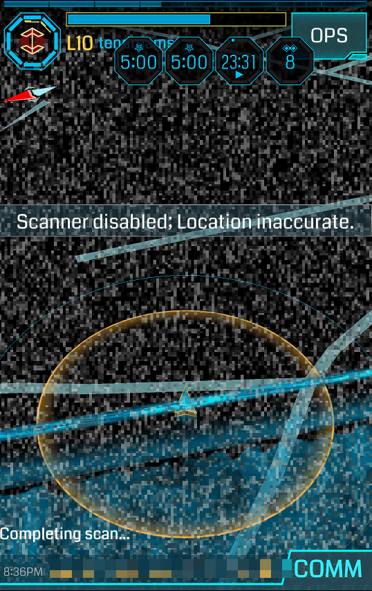
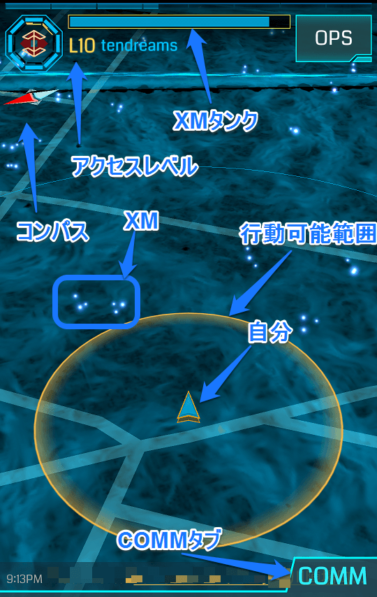
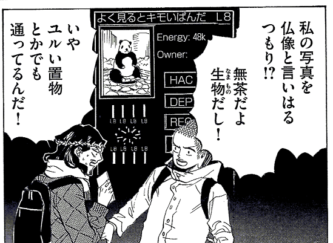

# 第一章 インストールと設定

## まずはGoogleアカウントが必要

この文章を書いている時点で、Ingressアプリには、Android版とiOS版とがあります。Ingressは、Googleの社内スタートアップである**ナイアンティック・ラボ（Niantic Labs）**が開発・運営しています。ナイアンティック・ラボのことを、**NIA**と省略することにします。英語圏発祥のゲームなので、この手の省略が多いです。慣れましょう。

当然ながら、当初はGoogleが開発したAndroidプラットフォーム専用のゲームとして開始されました。2012年に招待制のベータ版が運用開始され、2013年末に正式運用が開始されました。iOS版は2014年7月開始です。日本は例外的にiPhoneユーザーが多い国なので、日本でのIngressブームはiOS版のリリースが火付け役とも言えるでしょう。でも、2012年・招待制ベータ版、2013年・正式運用、という日付は覚えておきましょう。あとあと、人間関係で大切になってきます。

- **少し注意**：この文章を書いている時点で、Android版Ingressの最新バージョンが1.72.1、iOS版の最新バージョンが1.71.1です（という文章を書いている間にiOS版の1.72.1が出ました）。こういうズレが生じることが、たびたびあります。ぼくはAndroid版を使っているので、ここで使用する画面のスクリーンショットなどは、Android版のものであることに注意してください。また、Android版で確認できたことを、あたかもIngressの常識のようにぼくが書いているとしたら、ご指摘ください。逆もまたしかり。ネットで調べたことがiOS版に準拠していて、ぼくがそれを参考に書いたなら、Android版には合致していないということもありえます。同様に、ご指摘ください。

Googleの社内ベンチャーであるNIA、という点も重要です。Ingressを楽しむうえで、プレイヤーは、たびたび**Googleのサービス**を使うことになります。

Ingressアプリをインストールする前に、**Googleアカウントが必要**です。Ingressをインストールして起動すると、さっそくGoogleアカウントでログインすることを促されます（Ingressにログインするときにアカウントを作成することもできます）。

「Gmailなら持ってるから、さっそくそれでログイン……」と先走る前に、次のことを考えてください：

- すでに**Google+**（Googleプラス）に実名でアカウントを開設していませんか？　だとすれば、そのアカウントを使うと、他のプレイヤーが現実世界のあなたを特定できる可能性があります。
- **Gmailの名前**に、あなたの実名が設定されていませんか？　だとすれば、そのアカウントでGoogle+に参加すると、他のプレイヤーが現実世界のあなたを特定できる可能性があります（いずれGoogle+に参加することになるからです。Ingressを続けていくならば）。
- ［Androidユーザーなら］Androidと紐付けたGoogleアカウントを使うと、他のプレイヤーが現実世界のあなたを特定できる可能性があります。

これは単純に、あなたがプライバシーをどれぐらい大切にしたいか、ということに依存しています。Ingressは、ご存知のように、現実の物理的空間を自分の身体を移動させて行うゲームです。なので、完全なプライバシーを守ることは、じっさいには不可能です（たとえば、Ingressのプレイヤーであるということを、他の誰一人にも知られたくない、という要望にはどうしても応えられません。だって、背後からチラ見すればわかりますから）。

これは程度問題で、100%のプライバシーが守られないのならばIngressなんてやらない、という選択もアリでしょう。ぼくのように、エージェント名（Ingress内でのユーザ名）を手がかりにすれば住所・氏名・電話番号までシームレスにたどることができるようにしておくのは、ちょっとやり過ぎかもしれません（でもそうしているプレイヤーは少なくはありません）。

## Ingress用アカウントを作る

一般的には、**Ingress専用のGoogleアカウント**を作るのが懸命です。あとでIngressと紐付けるアカウントを変更することはできません（最初からやり直しになるのではないかと思いますが、その端末ではIngressができなくなるのかもしれません。未確認です）。

わざわざそうするのは、面倒だと感じますか？　次のことを考慮してください：

- **デスクトップ版Google Chrome**は、複数アカウントの使い分けが簡単です（ぼくは20ぐらいのGoogleアカウントを使い分けています）。
- **スマートフォンのGmail**アプリ（もしくは**Inbox**アプリ）は、複数アカウントの切り替えが簡単です。
- **スマートフォンのHangouts**アプリは、複数アカウントの切り替えが簡単です。
- **スマートフォンのGoogle+**アプリは、複数アカウントの切り替えが簡単です。
- **デスクトップ版Hangouts**（Chromeアプリ版）は、複数アカウントを使い分けるには、複数のHangoutsを起動しておく必要があります。

今列挙したGoogleサービスは、Ingressを楽しむためには、多くの場合、使うことになるサービスです（地域によって差はあります。[Hangoutsの代わりにSlackを使っている地域も多いようです](http://chezou.hatenablog.com/entry/2015/01/16/011049)。台湾ではLINEが使われているらしいですね）。

おおむね、Ingress専用のGoogleアカウントを使うことのデメリットはあまりないと考えてもよいでしょう。

もうIngressにログインしてしまった？　うん、まあ、大丈夫。Google+のプロフィールをつくるときに気をつけてくださいね。

## インストール＆起動！

ぼくはこの文章を、ぼくがRecruitした方の顔を思い浮かべて書いています。ぼくが顔を思い浮かべているあなたは、送られてきたリンクからインストールしてください。

そうでないなら、次のことを考慮してください：

- なんとかぼくにコンタクトをとって、ぼくからRecruitされてください。お互いにメリットがあります。
- 知り合いにIngressプレイヤーがいるなら、その方からRecruitされてください。
- Recruit経由でIngressのアカウントをアクティベートすることでメリットが生じるのは、Recruit対象になったGmailアカウントのみだということに注意してください。つまり**Ingress専用にGoogleアカウントを作るなら、改めて、Recruiter（リクルーター）に専用Gmailアドレスを教えてください。**

インストールしたら、さっそく起動します。この文章を書くにあたって、[「できるネット」の「iPhoneで『Ingress』（イングレス）に登録する方法」という記事](http://dekiru.net/article/4873/)を読んでいるのですが、驚いたことに、ログイン画面が日本語化されていますね！　そうするとここで改めて解説することもとくにないのですが……。

これから先のことも考慮するなら、次のことに注意してください：

- Ingressは位置情報を使ったゲームです。位置情報が可能な限り正確になるようにしましょう。
- 自宅や職場でWi-fiが使えるなら、Wi-fiをONにします。その他の場所ではOFFにするのが無難です。駅の構内などでWi-fi電波をつかむと、かなり位置がズレます。
- **GPSはつねにON**にしましょう。ただしバッテリーがすごい勢いで減っていきます。**モバイルバッテリーが必須**です。[定番はanker製](http://mediamarker.net/u/hidex7777/?asin=B00DQ7590A)ですが、[Ingress公式のものがcheero](http://mediamarker.net/u/hidex7777/?asin=B00RF9WUEI)から出ています。
- 位置が正確にIngressのサーバに伝わらない場合、"Scanner disabled; Location inaccurate"（スキャナー無効；位置が不正確）と表示されます。屋内でWi-fiがOFFになっているとか、屋外で電波の届きにくい場所にいるとかが原因です。
- Androidだと「機内モード」という一切のデータ通信を遮断するモードになっていることがあります（その場合"No Data Connection"と表示されます）。位置情報だけでなく、データ通信も不可能であるときは、ほとんどすべての操作ができません。

Googleアカウントでログインすると、お決まりの利用規約への承認が求められます。それからオープニングメッセージやなんやかんやがあります（たぶん、英語じゃなかったかな？）。

コードネーム（これはゲーム内では「エージェント名」と呼ばれます。なぜ用語を統一しないのかはわかりません）の入力では、プライバシーに気をつけて（他のプレイヤーは、何という名前のエージェントがどこでどういう行動をとったのかを知ることができます）名前を決めましょう。**カッコいい、あるいはカワイイ名前**にしましょう！　陣営ミーティング（という名の飲み会）で「その名前はないよ！」といじられないように（いじられるのも楽しいですけどね！）。

ちなみにぼくのエージェント名はtendreamsといいます。夏目漱石の短篇「夢十夜」からとっています（「夢十夜」の英訳タイトルを調べたら"Ten Nights' Dreams"だったので、あとで間違いに気づいたのですが、気に入っています）。

たびたびプライバシーのことを書いていますが、くれぐれもGoogleアカウントそのままの、つまり@gmail.comの@マークの前の部分を使わないようにしましょう。ぼくのエージェント名tendreamsでググると、Google+のプロフィールにたどり着くことができて、ぼくの住所・氏名・電話番号までたどり着くことができますが、それはオープンにしすぎです（でもtendreams@gmail.comにメールを送ってもぼくには届きませんよ）。

次に**Faction（陣営）**を選びます。「陣営」と日本語化されていますが、**ファクション**という言葉もよく使うので、覚えておきましょう。

選べるのは**Resistance**（青；RESと省略）か**Enlightened**（緑；ENLと省略）です。ぼくからRecruitを受け取った方は、迷わずRESを選びます。Ingressの外で知り合いどうしで、陣営が異なると、何かと不便ですし、あらぬ疑いをかけられます。談合とか！

「最終選択です」と脅されますが、1回だけ、現在のアカウントで、陣営を変えることができます（ヘルプセンターから申請）。ただし、レベル1からやり直しになるので気をつけましょう。

続いて、ゲームの概要の解説がなされるようです。いきなりいろいろ説明されても、すべてを覚えきれないでしょうから、最初は、この画面を**スキャナー**というんだ、ぐらいのことを覚えれば十分です。

## とはいえ、少しは説明します

三角形のクサビがありますね。これが自分の現在地です。端末を持ったまま、その場で360度回転してみて、地図が動くか、クサビが動くかを確認して下さい。

地図が動く（クサビは上を向いたまま固定）なら、コンパスが**Dynamic**（動的）モードになっています。OKです。

クサビが動く（地図は北が上）なら、コンパスが**Static**（静的）モードになっています。スキャナー左上にあるコンパスをタップしてDynamicモードにしましょう。通常の行動はDynamicモードがやりやすいでしょう。ちなみに［OPS］＞［DEVICE］＞［Compass］から変更することもできます。

自分の周りにサークルが描かれていますね。このサークル内（半径約40m）に対して、自分からアクションを起こすことができます。このサークルの外に対してアクションを起こそうとしても、"Out of Range"（範囲外）と表示されます。

スキャナー下に**COMM**というタブがあります。文字通り、コミュニケーションや通知に使われます。COMMタブ内には、**All**（RES・ENLの両方にメッセージ投下）・**Faction**（自陣にメッセージ投下）・**Alerts**（自分に関係するアラートの表示）の3つのタブがあり、またAllとFactionには、5kmから∞までのレンジを選択するバーがあります（∞にすると、世界中のメッセージを受信してしまうので、それこそフリーズの原因になります）。

iPhone版を使っている方は、このCOMMを開くとフリーズすることが多いようです。試しに開いてみて、自分は触ってもいいのか、避けたほうがいいのか、確認してみましょう。とくに都市部では頻発するようです。

**All**を注意深く眺めてください（フリーズしなかったなら）。どのエージェントが、どういう行動をとったのかが、誰にでもわかるようになっています（ただし、すべての行動ではありません。特定の行動だけが、Allに向けて公開されます）。

次に**Faction**を見てみましょう。こちらでは、コミュニケーションが盛んになされているのがわかると思います。

今のところ**Alerts**には何も表示されないはずです。なにか行動を起こしていない限り。

スキャナー上部に、RESなら青いバー（**XMタンク**）があります。これは、ロールプレイングゲームでいうHPのようなもので、**XM（エックスエム）**の量を表しています。RPGと違って、XMが0になったからといって死んだりゲームオーバーになったりはしません。スキャナーが赤い砂嵐になって、通常行動がとれなくなるだけです。XMの回復方法はいろいろありますので、心配いりません。

XMタンクの下に（はじめたばかりのあなたの場合）L1と書いてあるはずです。これはつまり、いわゆる「レベル」のことですが、Ingressでは**アクセスレベル**といいます。公式の呼び方ではないのかもしれませんが**エージェントレベル**と言ったりもします。「エージェントレベル1（アクセスレベル1）」を**A1**と表現します。地域の懇親会などでは「A1の何々です」と自己紹介しましょう。本名は言わなくていいです。エージェント名で言いましょう。ぼくは本名を言いますけどね。

Ingressで、すべてのアイテムを使用可能になるのはA8からなので、**当面の目標は、A8になること**だと言えます。

ここで、**XMタンク**をタップしてみましょう。たぶん、「3000/3000」と表示されると思います。A1の**XM上限**は3000です。この文章を書いている数日前に、A9以上のXM上限がアップしました。このようなシステム更新が頻繁にあるので、情報のアンテナをひろく持っておくとよいでしょう。

いまのところ、XMが減るような行動をとっていないので、XMは満タンだと思いますが、回復方法のうちのひとつは、スキャナーに写っている**XM（エキゾチックマター）**を回収することです。この白いツブツブは、人口密度が高い地域は多く（Android端末が滞在したことのある場所、という噂もありますが、未確認）、また、**ポータル**の周囲にも多く吹き出しています。XMに近づくとこれを回収することができ、自分のXMも回復します。

いま「吹き出している」と表現したのは、あなたに紹介しようと思って開いた伊集院光のラジオで「なんかエネルギーが吹き出している」と言っていたからです。

- [伊集院光のIngress解説（YouTube）](https://www.youtube.com/watch?v=3p9VlWNliB4)

最初の楽しみ方は、この伊集院光のトークを聞けば、大体わかります（削除されていなければですが）。あと、『聖☆おにいさん』11巻も、ですね（作者の中村光さんは、Ingressエピソードを執筆した時点でA8だったそうです）。

そうそう、もしかしたら、あなたの現在地から一番近いポータルの写真とそのレベル、現在地からの距離も、スキャナー上に表示されているかもしれません。この「ポータル」が、Ingressにとっての目的地のひとつと言えます。

スキャナー画面の説明は以上です。次に、画面右上にある［OPS］ボタンに移りましょう！
