# 第二章　［OPS］とチュートリアル

## OPS
では、さっそく、スキャナー右上に見える**［OPS］**ボタンをタップしましょう！

（たぶん、Operationsの略だと思いますが、よくわかりません！）

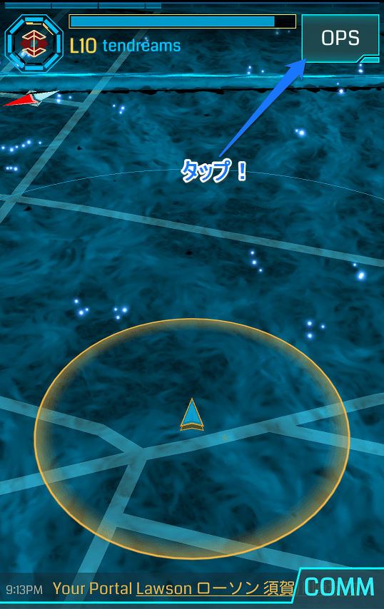

［OPS］ボタンを押すと、**INVENTORY**（インベントリ）が表示されます。

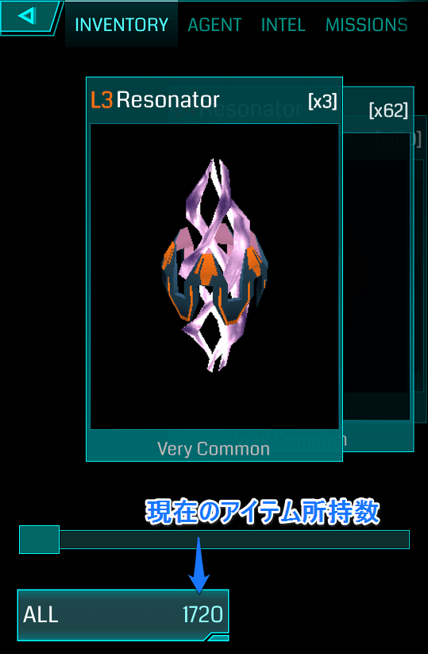

INVENTORYは、今あなたが持っているアイテムのリストです。左下に［ALL（全て）　数字］と表示されていますが、このボタンをタップすると、アイテムの種類ごとに分類することができます。

はじめたばかりだと、数も少ないので、ALL（全て）のままでよいかと思います。

所持できるアイテム数は、**端末のSMS認証**（すぐに解説するのでご心配なく）が済むまでは100が上限で、認証が済むと2000です。これがけっこうキツい（**「インベントリが圧迫される」**と表現します）のですが、それはおいおい苦しんでください。

画面上部のメニューを左にスワイプすると、**TRAINING**（トレーニング）というのがあります。Ingressを本格的に開始する前に、このトレーニングをやっておくとよいでしょう。ルールややるべきことが、なんとなくわかると思います。

TRAINING（トレーニング）についてはこの章の後半で解説するので、先に他のメニューを見てみましょう。画面上部のメニューを左にスワイプして、**DEVICE**（設定）をタップします。

いまのところ、設定すべき項目は、

- **Verification**：端末をSMS認証。これについては説明します。
- **Sound**（サウンド）：音量バランスを調整。
- **Compass**（コンパス）：Static（静的）になっていたらDynamic（動的）にトグル。
- **Email**（メール）：「Ingressの関連イベント、キャンペーン～送信する。」だけONにしておきましょう。
- **Notification**（通知）：はじめは全部ONにしておくのが無難。

ぐらいです（通知がうっとうしいと感じたら、いつでも変更できます）。

まず、アイテム所持上限を100から2000にあげるために（というか、これは端末の不正な使用を防止する目的で行われます）、**SMS認証**を済ませてしまいましょう。

［Verify Now］をタップし、端末の電話番号を入力します。以前は、日本の国番号「81」をつけて、冒頭の「0」を削り、「819055551111」のように入力しなければなりませんでしたが、今は、「81」を付けずに「09055551111」だけでもいいようです（電話番号が090-5555-1111の場合）。

キャリアの国際SMS受信拒否設定がなされていないのであれば、SMSで、確認コードが届くはずです（6桁の数字）。

スキャナーに表示される（はずの）チェックマークをタップするか、［OPS］＞［DEVICE（設定）］＞［Verification］から入力画面に移動して、6桁の確認コードを入力します。

うまく認証されれば、［OPS］＞［AGENT（エージェント）］にチェックマークのメダルが現れています。

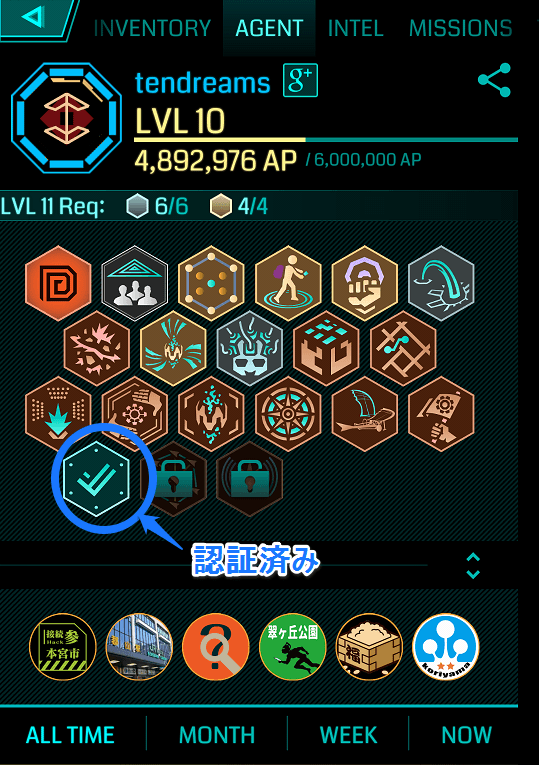

［DEVICE（設定）］＞［**Tutorials**（チュートリアル）］でチュートリアルをリセットしてやりなおすことができるようになっていますが、ここでいうTutorialsはさっき述べた**TRAINING**（トレーニング）のことです。なんで用語を統一しないのかは謎です。

## TRAINING（トレーニング）
さて、外出する準備ができたら、公園ぐらいの広さの場所に移動して、TRAININGを開始してください。

多くの方は、トレーニングをやっただけで、「なんのこっちゃ？」となって、「つまんない」と思ってやめてしまいます。もったいない。そこで、少し詳しく、ここのところを解説しましょう。

TRAININGには、次の8つ（実質、ミッション1から7まで）の項目があります：

0. First Contact（ファースト・コンタクト）
1. Retrieve XM（XMを集める）
2. Hack a Portal（ポータルハック）
3. Fire XMP（XMPの発射）
4. Deploy Resonator（レゾネータのデプロイ）
5. Resonating（レゾネータ）
6. Links（リンク）
7. Fields（フィールド）

順番にいきましょう。

### 【First Contact】（ファースト・コンタクト）
レジスタンス陣営なら、我々のリーダー**ADA**（エイダ）からのメッセージがあります。

> Do not be afraid.（恐れることはありません。）

> You have downloaded what you believe to be a game, but it is not.（あなたはゲームをダウンロードしたと思っているでしょう、でもそれは違います。）

> Exotic matter of unknown origin is seeping into our world.（正体不明のXM（エキゾチックマター）が我々の世界に侵入しようとしています。）

> You must pick a side in the fight for our planet.（どちらのFaction（陣営）につくか選択しなければなりません。いまこそ地球のための戦いに参加する時です。）

そう、あなたは地球のために戦うのです！

### 【Retrieve XM】（XMを集める）
次に、その正体不明のエキゾチックマター（**XM**）を回収します。

ここからは屋外でやります。これは簡単で、スキャナーに表示されている白いツブツブに近づけば、向うからこちらに吸収されます。

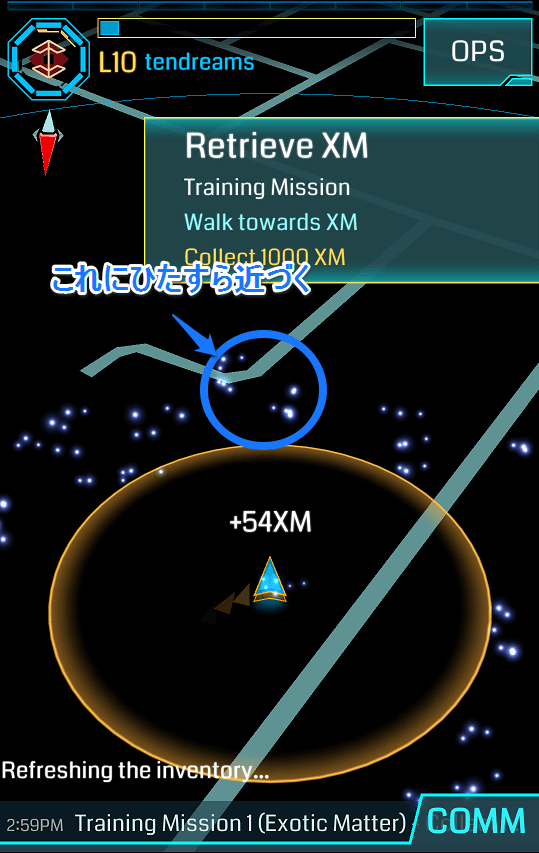

黄色いサークル内にXMが入れば（そしてあなたが徒歩の速度で移動していれば）、吸収されることになっています。

1000XMを回収すれば、このトレーニングは終了です。回収が済めば、ADAから「XMはあなたの周りのいたるところに存在している。XMはきわめて重要だ。あなたの保持するXMを高く維持しておいて欲しい」とかなんとかメッセージが入ります。

XMとは何か？　どんな意味で重要なのか？　などは、Ingressの背景ストーリーに関係することですが、背景ストーリーや設定はあとから知ればよいことです。

### 【Hack a Portal】（ポータルハック）
次はいよいよ、Ingressの目的地のひとつである**ポータル**の登場です。

といっても、TRAINING中は、近くに**本物の**ポータルがなくても大丈夫です。シミュレーションされたポータルを使います（近くにポータルがあれば、それがトレーニング用に使われるかもしれません）。

スキャナーの、現在地の近くをタップします。白い、輝くナニカが現れたら、［CHOOSE］ボタンをタップします。

ちなみにこの白い輝くナニカは、**中立化（Neutralized）**したポータルです。レジスタンスのものでも、エンライテンドのものでもない、まっさらな状態のポータルです。

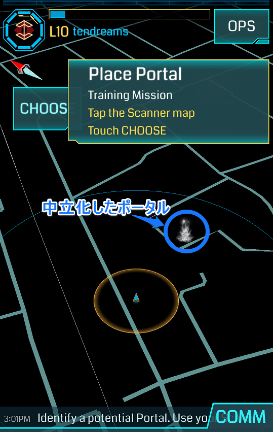

［CHOOSE］をタップすると、おそらく、（あなたがレジスタンス陣営なら）ポータルが緑色になるでしょう。つまりエンライテンドが所有（own）しているポータルになります。

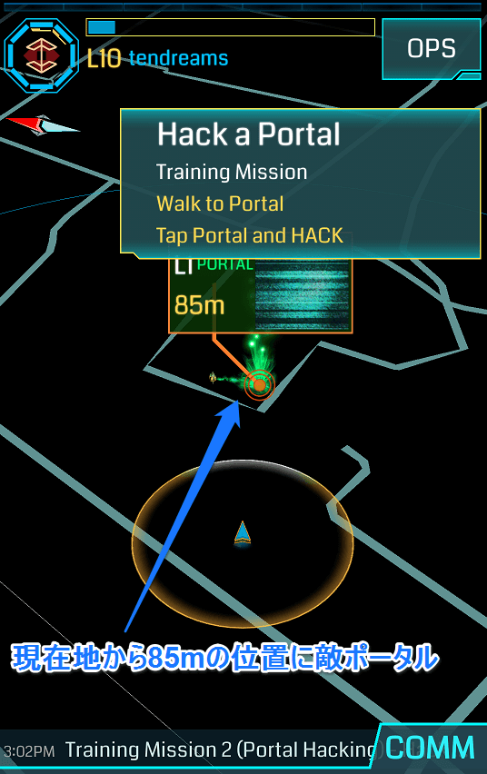

この緑色になったポータルが、黄色いサークルの内側に入るまで近づき（つまり40m以内まで近づいて）ポータルをタップします。

すると、ポータル詳細画面が開きます（ちなみに、40m以内に近づいていなくても、この画面は出ます）。

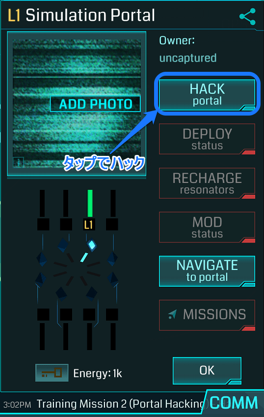

ポータル詳細画面に**［HACK portal（Hack ハック）］**というボタンがあるので、これをタップします（40ｍ以内に近づいていない状態ではこのボタンが無効です）。

敵ポータルをハックするとダメージをくらいます（XMが減る）。

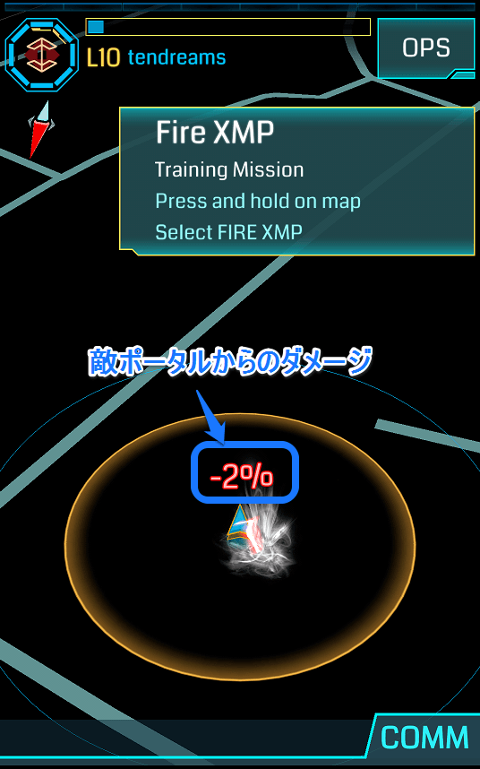

これで「ポータルハック」は終わりです。「L1 Xmp Burster」というアイテムを得られたかと思います。これは次のTRAININGで使用します。

### 【Fire XMP】（XMPの発射）
前のTRAININGでは、敵ポータルをハックするだけでした。こんどはこれを攻撃します。

使うのは**Xmp Burster**（エックスエムピー・バースター）です。

Ingressでは、使用アイテムの多くに「レベル」が設定されています。1～8まであります。これはエージェントのアクセスレベルに対応していて、**A1は、レベル1のアイテムしか使えません。**

Xmp Bursterは、ゲーム内では**XMP**と省略されます。「レベル8のXmp」を**X8**と略したりもします。X8の威力はすごいです。ぶっ放したときの快感が違います。ぜひその威力を味わえるレベルに到達してください。

さてTRAININGですが。敵ポータルをロングタップ（ホールド）します。上と左右にメニューが表示されるので、上の［FIRE XMP］にそのままスワイプします。

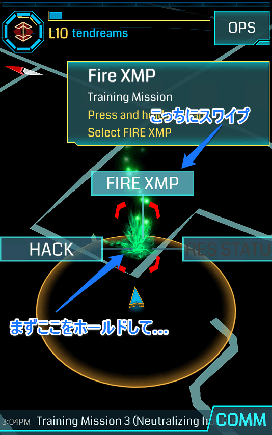

現在、**A1であるあなたは、X1しか使えません**。画面にX1が選択された状態で表示されるので、［FIRE］ボタンをタップします。

たぶん、1発で中立化します（白くなる）。XMPで攻撃する、という行動は自分のXMを少し消費します（向うからの反撃以外に、「使用コスト」がかかります）。

［DONE（完了）］をタップしてTRAININGを終了します。

### 【Deploy Resonator】（レゾネータのデプロイ）
次は「レゾネータのデプロイ」です。実戦でも非常に重要なので、ここで理解しましょう。

**ひとつのポータルには、最大で8本のレゾネータを設置（デプロイ）することができます。**

レゾネータ（共鳴装置）にもレベルがあって、これも「レベル1のレゾネータ」は**R1**などと省略します。

中立化したポータルは、レゾネータを挿す枠が、8つすべて、ガラ空きになっています。これに1本でもレゾネータを挿せば、そのポータルは味方陣営のものになります。ポータル詳細画面の**Ownerには、1本めのレゾネータを挿したエージェント名が表示**されます。

このように、中立化したポータルを自陣のものにすること（つまりそのポータルに1本めのレゾネータを挿すこと）を**キャプチャ**といいます。

TRAININGでは、まずポータルをタップして、ポータル詳細画面を表示します。

さっきの［HACK portal（ハック）］の下にある、**［DEPLOY resonator（デプロイ）］**ボタンをタップします。

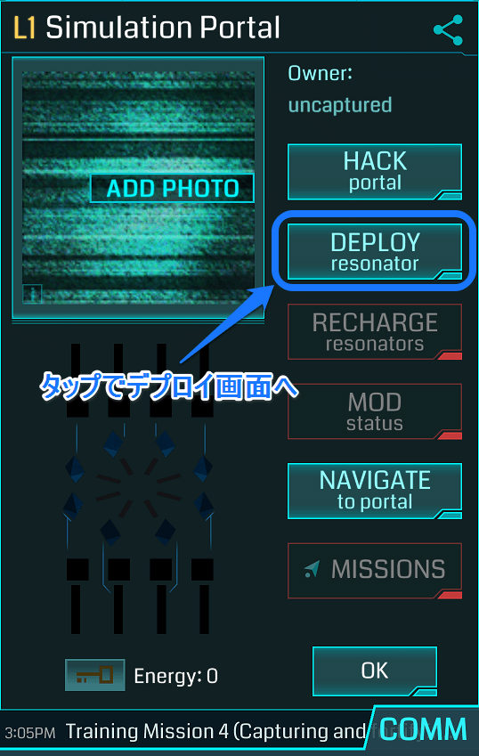

デプロイ画面が表示されます。

現在**A1であるあなたは、R1しか使えません**。R1が選択された状態で**［CONFIRM（確定）］**ボタンをタップします。

たぶん、レゾネータを1本しか所持していない、という設定でTRAININGは進められるので、これでデプロイは終わりです。

レゾネータのデプロイにも、自分のXMを少し消費します。

［DONE（完了）］をタップします。

### 【Resonating】（レゾネータ）
次のトレーニングは、「レゾネータ」とひとくくりにされていますが、

1. ハック
2. 残りのレゾネータ枠をデプロイで埋める
3. XMが減衰しているレゾネータをリチャージする

という3つのことが求められます。

では、またポータルをタップして、［HACK］します。たぶんR1を4本、獲得できるのではないでしょうか。

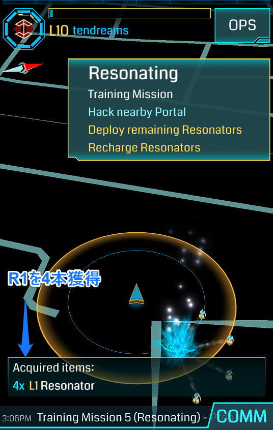

そしてこのポータルには、すでに4本のレゾネータがデプロイされています。

［DEPLOY］をタップして、R1を［CONFIRM（確定）］します。

このとき、たんに［CONFIRM］だけでもいいですし、空いている枠をタップで選択してから［CONFIRM］でもかまいません。

すべての枠が埋まったら、［DONE（完了）］です。

いま自分でデプロイしたレゾネータは、XMが満タンですが、先に挿さっていたレゾネータのXMは減衰しています。このXMを、**リチャージ**することで回復させます。

［DEPLOY（デプロイ）］ボタンの下の**［RECHARGE resonators（リチャージ）］**をタップします。

**［RECHARGE ALL（全てRecharge）］**をタップします。減衰していたレゾネーターのXMが回復し、自分のXMが消費されます。

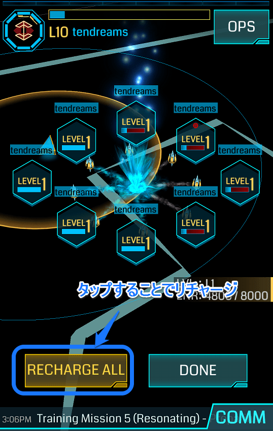

リチャージが完了したら［DONE（完了）］をタップします。

###【Links】（リンク）
いよいよリンクです。

この「リンク」という行動と、次の「コントロールフィールド作成」という行動が、レベルアップのための主要な行動になってきます。

**重要です！**

ポータルとポータルをリンクするには、

1. 2つの味方ポータルがある
2. どちらもレゾネータが8本挿さっている
3. どちらかの「ポータルキー」を持っている（リンクを受ける側のキーが必要）
4. ポータルの間に他のリンクがない
5. リンクを発する（アウト・リンクを打つ）側が、コントロールフィールドに沈んでいない

という5つの条件があります（他に、「ポータルレベル」が、「リンク可能距離」に到達している、というのもありますが、これは後で説明します）。

TRAININGでは、まず1つめのポータルをハックすることで、**Portal Key**（ポータルキー）を獲得します。

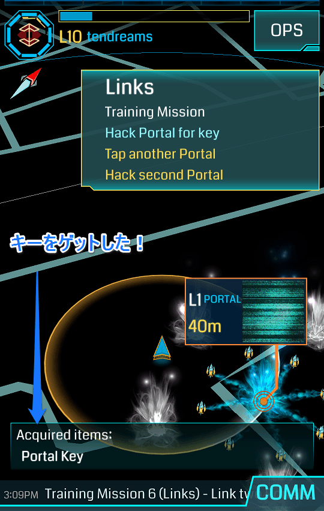

次に、2つめのポータルが中立化していると思うので、これをハックします。おそらくレゾネータを8本入手できます。このポータルに8本のレゾネータをデプロイします。

8本のレゾネータが設置されたポータルは、**リンク可能**になります。

1つめのポータルからすでにポータルキーを入手しているので、2つめのポータルからリンクを打てます。ちなみに、この時点で1つめのポータルをタップしてポータル詳細画面を開くと、次のようにキーを所有していることを確認できます。

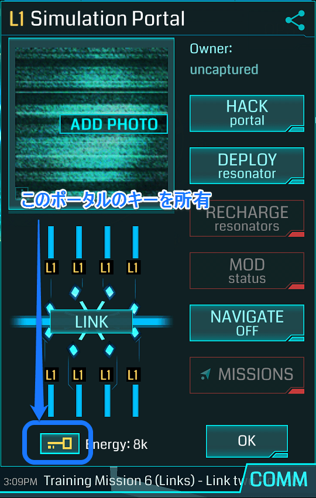

2つめのポータルの詳細画面の［LINK］ボタンをタップします。スキャナーが、リンク可能なポータルをサーチし始めます。

キーを持っているので、1つめのポータルが、リンク可能なポータルとして表示されます。

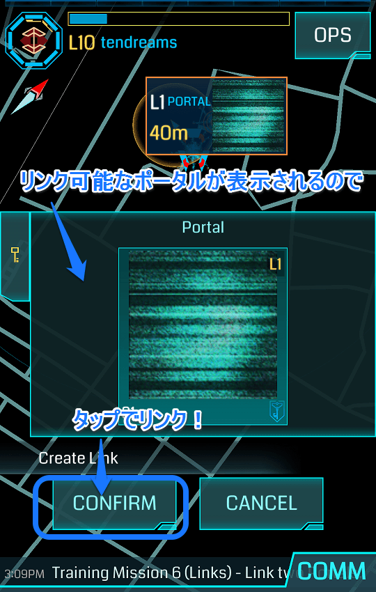

**［CONFIRM（確定）］**をタップします。「LINK Established!」と表示されれば、リンク成功です！　**リンクを打つことで、ポータルキーは消費されます。**

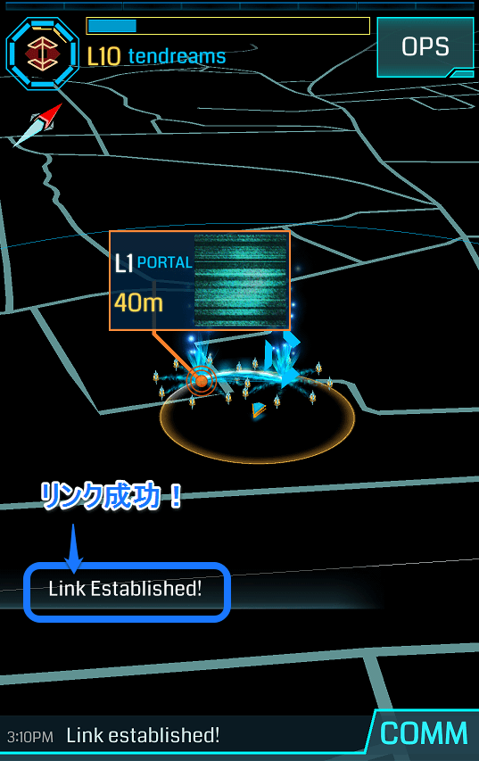

### 【Fields】（フィールド）
いよいよ、**コントロール・フィールド（CF）**を作成するという、Ingress最大の山場がやってきました！

実戦でも、もっともレベルアップに貢献する行動が、CF作成です。非常に大事なので、頑張りましょう！

CFを作るには、3つのポータルが必要です。この3つのポータルが、リンクで結ばれると、CFになります。なので、作成条件は、リンクと同じです。

ポータルの間に他のリンクがないこと、CFに沈んでいる状態ではアウト・リンクを打てないこと、3本のリンクが必要なので、3つのポータルキーが必要になること。

ここまでのTRAININGでやったことの復習になります。

第1ポータルをハックしてキーをゲット。

第2ポータルをハックしてキーとレゾネータをゲット。

第2ポータルにデプロイして、第1ポータルにリンク。

第3ポータルをハックしてキーとレゾネータをゲット。

第3ポータルにデプロイして、第2ポータルにリンク。

第1ポータルから第3ポータルにリンク。

この順番でなくてもかまいません。うまくコントロール・フィールドができれば、TRAININGはすべて終了です！

## レベルアップのために
TRAININGが終わったら、さっそく実戦です。

さて、「当面の目標はA8になること」と言いましたが、どうすればレベルがアップするのでしょうか。

エージェントのレベルのことを**アクセスレベル**といいました。アクセスレベルを上げるには、A8までの場合、**アクセスポイント（AP）**を取得すること**だけ**が必要です（A8以上は、APに加えて「実績」が必要になります）。

APは、RPGなどでいう「経験値」のようなものです。A1からA2へ「レベルアップ」するには、**2500**AP必要です。A2からA3になるには**17500**AP必要です（累積20000AP）。Ingressは、一般的なRPGなどと違って、「レベルアップまでの道のりが長い」ゲームです。ときには急いで、しかし大体においてのんびり、やっていくのがコツです。

［OPS］＞［AGENT（エージェント）］、またはスキャナー左上の**エンブレムをタップ**で、エージェントプロフィール画面を開くことができます。もしまだ何も実戦での行動をしていなければ、「0 AP/2500 AP」と表示されています。この数値は**つねに「累積」で表示**されます。

では、A1やA2ぐらいのときに、実際的に、APを獲得できる行動にはどのようなものがあるでしょうか。

Ingressには、たくさんのAP獲得方法があり、また、たびたびAP加算条件の変更があります。

その中から、A1～A4ぐらいの時点で容易に獲得できる方法を、その簡単さの順に挙げていきます：

1. 敵陣営ポータルのハック（100AP）
2. 自陣営ポータルへのリチャージ（10AP）※消費XMではなく回数
3. MODの設置（125AP）※MODとは何か、については第六章で説明
4. リンク（313AP）
5. CF作成（1250AP）※リンクと同時にCFはできるので画面には1563APと出る
6. ポータルへの写真追加が承認（500AP）※第七章で説明します
7. ポータルの名称変更が承認（200AP）※第七章で説明します
8. ポータルの説明文の変更/追加が承認（200AP）※第七章で説明します
9. グリフハック（50～462AP）※グリフハックについては第五章で説明します
10. 新規ユーザーの招待（3000AP）※招待された人にはアイテム一式

1回のリチャージで10AP稼げます。これが馬鹿にできません（リチャージは実績にも関わってくるので、初めのうちから積極的にやっておきましょう）。

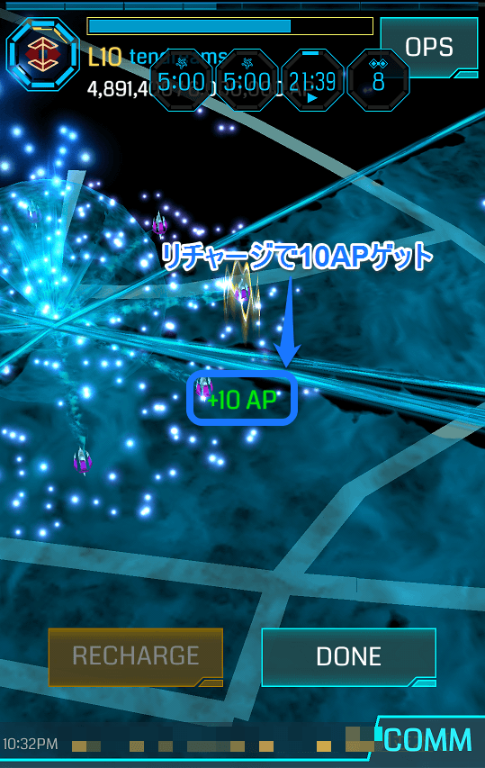

A1～A4ぐらいまでは、XMPを使って敵ポータルを中立化するのは、かなり難しいでしょう（たまに初心者育成のために壊しやすくしておいてくれるエージェントもいます）。

中立化できない、となると、**キャプチャ**（ポータルに1本めのレゾネータを挿すこと）も難しいでしょう（もし、偶然、中立化したまま放って置かれているポータルを見つけたら、すぐにキャプチャしましょう！）。

レゾネータは、低いレベルのものの上に、高いレベルのものを「上書き」することができます（これを**アップグレード**といいます）。これも、A1ではR1しか使えないのですから、そもそもアップグレードできません。

そうすると、できることが限られてきます。

おススメは、高レベル・エージェントと行動を共にして、APを稼がせてもらうことです。高レベル・エージェントが破壊・中立化して、低レベル・エージェントがデプロイ、高レベル・エージェントがアップグレード、低レベル・エージェントがリンクやCFの作成、というのが一般的ではないでしょうか（キーが足りない時は、高レベル・エージェントがドロップしてくれます）。

すべてのエージェントがA1からスタートしていて、初期のレベルアップの大変さをわかっていますし、なによりも味方陣営の高レベル・エージェントが育ってくれることを誰もが望んでいるので、喜んで「休日返上」してくれることでしょう。

あなたをRecruitした人がいるならば、その人に声をかけてみましょう。

また、近くで、「First Saturday」というイベント（**FS**）が開催されるならば、それに参加しない手はありません。

たぶん、FSに参加すれば、1日で10万以上のAPを稼げるでしょう。積極的に、この手のイベントに参加することをオススメします。

もう一つ、**遠隔リチャージ**を覚えておくとよいでしょう。ポータルキーを持っていれば、INVENTRY（インベントリ）からポータルキーを選択し、そのポータルの近くにいなくても、リチャージすることができます。

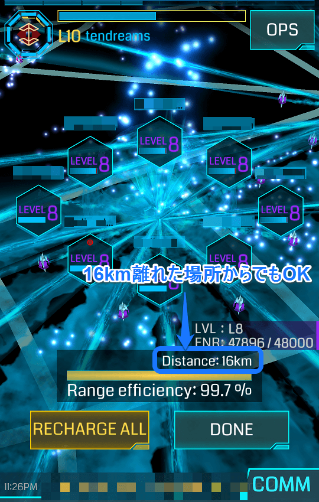

じつはぼくは、A8になるまで知らなかったのですが、リチャージ画面で、各レゾネータをタップして選択してからリチャージすると、1本ずつ、リチャージすることができます。

リチャージによるAP獲得は、消費XMではなく、回数によります。ということは、8本のレゾネータがすべて減衰していれば、最低でも8回、合計80APを稼ぐことができます！

次章では、ポータルの探し方の基本である、Intelマップの使い方を解説します！
