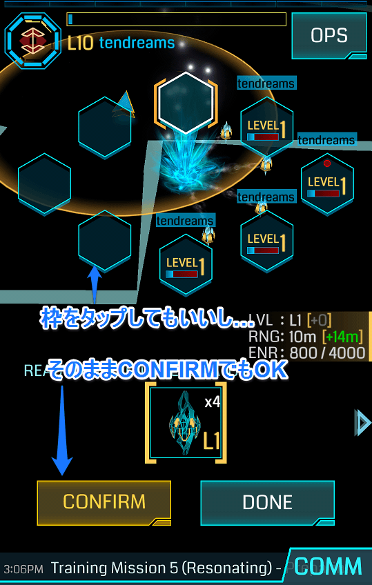

# 第二章　［OPS］とチュートリアル

## OPS

では、さっそく、スキャナ右上に見える**［OPS］**ボタンをタップしましょう！

（たぶん、Operationsの略だと思いますが、よくわかりません！）

［OPS］ボタンを押すと、**INVENTORY**（目録、一覧表）が表示されます。

INVENTORYは、今あなたが持っているアイテムのリストです。左下に［ALL　数字］と表示されていますが、このボタンをタップすると、アイテムの種類ごとに分類することができます。

はじめたばかりだと、数も少ないので、ALLのままでよいかと思います。

所持できるアイテム数は、端末のSMS認証（すぐに解説するのでご心配なく）が済むまでは100が上限で、認証が済むと2000です。これがけっこうキツい（「インベントリが圧迫される」と表現します）のですが、それはおいおい苦しんでください。

画面上部を左にスワイプすると、**TRAINING**（トレーニング）というのがあります。Ingressを本格的に開始する前に、このトレーニングをやっておくとよいでしょう。ルールややるべきことが、なんとなくわかると思います。

TRAININGについてはこの章で解説するので、先に他のメニューを見てみましょう。画面上部のメニューを左にスワイプして、**DEVICE**をタップします。ここでいわゆる「設定」をします。

いまのところ、設定すべき項目は、

- **Verification**（端末をSMS認証。これについては説明します）
- **Sound**（音量バランスを調整）
- **Compass**（StaticになっていたらDynamicにトグル）
- **Email**（「Send me Ingress-related events～」だけONにしておきましょう）
- **Notification**（はじめは全部ONにしておくのが無難）

ぐらいです。

まず、アイテム所持上限を100から2000にあげるために（というか、これは端末の不正な使用を防止する目的で行われます）、SMS認証を済ませてしまいましょう。

［Verify Now］をタップし、端末の電話番号を入力します。以前は、日本の国番号「81」をつけて、「819055551111」のように入力しなければなりませんでしたが、今は、「81」を付けずに「09055551111」だけでもいいようです（電話番号が090-5555-1111の場合）。

キャリアの国際SMS受信拒否設定がなされていないのであれば、SMSで、確認コードが届くはずです（6桁の数字）。

スキャナに表示される（はずの）チェックマークをタップするか、［OPS］＞［DEVICE］＞［Verification］から入力画面に移動して、6桁の確認コードを入力します。

うまく認証されれば、［OPS］＞［AGENT］にチェックマークのメダルが現れています。

**Tutorials**でチュートリアルをリセットしてやりなおすことができるようになっていますが、ここでいうTutorialsはさっき述べた**TRAINING**のことです。なんで用語を統一しないのかは謎です。

## TRAINING
さて、外出する準備ができたら、公園ぐらいの広さの場所に移動して、TRAININGを開始してください。

多くの方は、トレーニングをやっただけで、「なんのこっちゃ？」となって、「つまんない」と思ってやめてしまいます。もったいない。そこで、少し詳しく、ここのところを解説しましょう。

TRAININGには、次の8つの項目があります：

1. First Contact（ファースト・コンタクト）
2. Retrieve XM（XMを回収せよ）
3. Hack a Portal（ポータルをハックせよ）
4. Fire XMP（XMPを撃て）
5. Deploy Resonator（レゾネータをデプロイせよ）
6. Resonating（レゾネータを共鳴させよ）
7. Links（リンクせよ）
8. Fields（フィールドをつくれ）

順番にいきましょう。

### 【First Contact】
レジスタンス陣営なら、我々のリーダー**ADA**（エイダ）からのメッセージがあります。ちょっと下手な直訳をしてみます。

> Do not be afraid.（心配はしないで欲しい）

> You have downloaded what you believe to be a game, but it is not.（あなたは、ゲームだと信じてこのアプリをダウンロードしただろう。しかし、じつはゲームではない）

> Exotic matter of unknown origin is seeping into our world.（正体不明の、エキゾチック・マターが、我々の世界に湧き出してきている）

> You must pick a side in the fight for our planet.（あなたは、地球のために戦うため、どちらにつくのか選ばなければならない）

そう、あなたは地球のために戦うのです！

### 【Retrieve XM】
次に、その正体不明のエキゾチック・マター（**XM**）を回収します。

ここからは屋外でやります。これは簡単で、スキャナに表示されている白いツブツブに近づけば、向うからこちらに吸収されます。

おそらく黄色いサークル内にXMが入れば、吸収されるのではないでしょうか。

1000XMを回収すれば、このトレーニングは終了です。回収が済めば、ADAから「XMはあなたの周りのいたるところに存在している。XMはきわめて重要だ。あなたの保持するXMを高く維持しておいて欲しい」とかなんとかメッセージが入ります。

XMとは何か？　どんな意味で重要なのか？　などは、Ingressの背景ストーリーに関係することですが、背景ストーリーや設定はあとから知ればよいことです。

### 【Hack a Portal】
次はいよいよ、Ingressの目的地のひとつである**ポータル**の登場です。

といっても、TRAINING中は、近くに本物のポータルがなくても大丈夫です。シミュレーションされたポータルが現れます（近くにポータルがあれば、それがトレーニング用に使われるかもしれません）。

スキャナの、現在地の近くをタップします。白い、輝くナニカが現れたら、［CHOOSE］ボタンをタップします。

ちなみにこの白い輝くナニカは、**中立化（Neutralized）**したポータルです。レジスタンスのものでも、エンライテンドのものでもない、まっさらな状態のポータルです。

［CHOOSE］をタップすると、おそらく、（あなたがレジスタンス陣営なら）ポータルが緑色になるでしょう。つまりエンライテンドが所有（own）しているポータルになります。

この緑色になったポータルが、黄色いサークルの内側に入るまで近づき（つまり40m以内まで近づいて）ポータルをタップします。

すると、ポータル詳細画面が開きます（ちなみに、40m以内に近づいていなくても、この画面は出ます）。

ポータル詳細画面に［HACK portal］というボタンがあるので、これをタップします（40ｍ以内に近づいていない状態ではこのボタンが無効です）。

敵ポータルをハックするとダメージをくらいます（XMが減る）。

これで「ポータルのハック」は終わりです。「L1 Xmp Burster」というアイテムを得られたかと思います。これは次のTrainingで使用します。

### 【Fire XMP】
前のTRAININGでは、敵ポータルをハックするだけでした。こんどはこれを攻撃します。

使うのは**Xmp Burster**（エックスエムピーバースター）です。

Ingressでは、使用アイテムの多くに「レベル」が設定されています。1～8まであります。これはエージェントのアクセスレベルに対応していて、A1は、レベル1のアイテムしか使えません。

Xmp Bursterは、ゲーム内では**XMP**と省略されます。「レベル8のXmp」を**X8**と略したりもします。X8の威力はすごいです。ぶっ放したときの快感が違います。ぜひその威力を味わえるレベルに到達してください。

さてTRAININGですが。敵ポータルをロングタップ（ホールド）します。上と左右にメニューが表示されるので、［FIRE XMP］と書いてある、上のメニューにそのままスワイプします。

現在、**A1であるあなたは、X1しか使えません**。画面にX1が選択された状態で表示されるので、［FIRE］ボタンをタップします。

たぶん、1発で中立化します（白くなる）。XMPで攻撃する、という行動は、自分のXMも少し消費します。

［DONE］をタップしてTRAININGを終了します。

### 【Deploy Resonator】
次は「レゾネーターのデプロイ」です。実戦でも非常に重要なので、ここで理解しましょう。

**ひとつのポータルには、最大で8本のレゾネーターを設置（デプロイ）することができます。**

レゾネーター（共鳴装置？）にもレベルがあって、これも「レベル1のレゾネーター」は**R1**などと省略します。

中立化したポータルは、レゾネーターを挿す枠が、8つすべて、ガラ空きになっています。これに1本でもレゾネーターを挿せば、そのポータルは味方陣営のものになります。ポータル詳細画面の**Ownerには、1本めのレゾネーターを挿したエージェント名が表示**されます。

このように、中立化したポータルを自陣のものにすること（つまりそのポータルに1本めのレゾネーターを挿すこと）を**キャプチャ**といいます。

TRAININGでは、まずポータルをタップして、ポータル詳細画面を表示します。

さっきの［HACK portal］の下にある、［DEPLOY resonator］ボタンをタップします。

デプロイ画面が表示されます。

現在**A1であるあなたは、R1しか使えません**。R1が選択された状態で［CONFIRM］ボタンをタップします。

たぶん、レゾネータを1本しか所持していない、という設定でTRAININGは進められるので、これでデプロイは終わりです。

レゾネーターのデプロイにも、自分のXMが少し消費します。

［DONE］をタップします。

### 【Resonating】
次のトレーニングは、「レゾネ―ティング（共鳴化？）」とひとくくりにされていますが、

1. ハック
2. 残りのレゾネーター枠をデプロイで埋める
3. XMが減衰しているレゾネーターをリチャージする

という3つのことが求められます。

では、またポータルをタップして、［HACK］します。たぶんR1を4本、獲得できるのではないでしょうか。

そしてこのポータルには、すでに4本のレゾネーターがデプロイされています。

［DEPLOY］をタップして、R1を［CONFIRM］します。

このとき、たんに［CONFIRM］だけでもいいですし、空いている枠をタップで選択してから［CONFIRM］でもかまいません。

すべての枠が埋まったら、［DONE］です。

いまデプロイしたレゾネーターは、XMが満タンですが、先に挿さっていたレゾネーターのXMは減衰しています。このXMを、**リチャージ**することで回復させます。

［DEPLOY］ボタンの下の［RECHARGE resonators］をタップします。

［RECHARGE ALL］をタップします。減衰していたレゾネーターのXMが回復し、自分のXMが消費されます。

リチャージが完了したら［DONE］です。

###【Links】
いよいよリンクです。

この「リンク」という行動と、次の「コントロールフィールド作成」という行動が、レベルアップのための主要な行動になってきます。

重要です！

ポータルとポータルをリンクするには、

1. 2つの味方ポータルがある
2. どちらもレゾネーターが8本挿さっている
3. どちらかの「ポータルキー」を持っている（リンクを受ける側のキーが必要）
4. ポータルの間に他のリンクがない
5. リンクを発する（アウトリンクを打つ）側が、コントロールフィールドに沈んでいない

という5つの条件があります（他に、「ポータルレベル」が、「リンク可能距離」に到達している、というのもありますが、これは後で説明します）。

TRAININGでは、まず1つ目のポータルをハックすることで、**Portal Key**（ポータルキー）を獲得します。

次に、2つ目のポータルが中立化していると思うので、これをハックします。おそらくレゾネーターを8本入手できます。このポータルに8本のレゾネーターをデプロイします。

8本のレゾネーターが設置されたポータルは、リンク可能になります。

1つ目のポータルからすでにポータルキーを入手しているので、2つ目のポータルからリンクを打てます。

2つ目のポータルの詳細画面の［LINK］ボタンをタップします。スキャナが、リンク可能なポータルをサーチし始めます。

キーを持っているので、1つ目のポータルが、リンク可能なポータルとして表示されます。

［CONFIRM］をタップします。「LINK Established!」と表示されれば、リンク成功です！　**リンクを打つことで、ポータルキーは消費されます。**

### 【Fields】
いよいよ、**コントロールフィールド**（**CF**と省略）を作成するという、Ingress最大の山場がやってきました！

実戦でも、もっともレベルアップに貢献する行動が、CF作成です。非常に大事なので、頑張りましょう！

CFを作るには、3つのポータルが必要です。この3つのポータルが、リンクで結ばれると、CFになります。なので、作成条件は、リンクと同じです。

ポータルの間に他のリンクがないこと、CFに沈んでいる状態ではアウトリンクを打てないこと、3本のリンクが必要なので、3つのポータルキーが必要になること。

ここまでのTRAININGでやったことの復習になります。

第1ポータルをハックしてキーをゲット。

第2ポータルをハックしてキーとレゾネーターをゲット。

第2ポータルにデプロイして、第1ポータルにリンク。

第3ポータルをハックしてキーとレゾネーターをゲット。

第3ポータルにデプロイして、第2ポータルにリンク。

第1ポータルから第3ポータルにリンク。

この順番でなくてもかまいません。うまくコントロールフィールドができれば、TRAININGはすべて終了です！

## レベルアップのために
TRAININGが終わったら、さっそく実戦です。

さて、「当面の目標はA8になること」と言いましたが、どうすればレベルがアップするのでしょうか。

エージェントのレベルのことを**アクセスレベル**といいました。アクセスレベルを上げるには、A8までの場合、**アクセスポイント（AP）**を取得することだけが必要です（A8以上は、APに加えて「実績」が必要になります）。

APは、RPGなどでいう「経験値」のようなものです。A1からA2へ「レベルアップ」するには、**2500**AP必要です。A2からA3になるには**17500**AP必要です（累積20000AP）。

［OPS］＞［AGENT］、またはスキャナ左上のエンブレムをタップで、エージェントプロフィール画面を開くことができます。もしまだ何も実戦での行動をしていなければ、「0 AP/2500 AP」と表示されています。この数値は**つねに「累積」で表示**されます。

では、A1とかA2とかで、実際的に、APを獲得できる行動にはどのようなものがあるでしょうか。

Ingressには、たくさんのAP獲得方法があり、また、たびたびAP加算条件の変更があります。

その中から、A1～A2ぐらいの時点で容易に獲得できる方法を、その簡単さの順に挙げていきます：

1. 敵ポータルのハック（100AP）
2. ポータルへのリチャージ（10AP）※消費XMではなく回数
3. MODの設置（125AP）※MODとは何か、については次章で説明
4. リンク（313AP）
5. CF作成（1250AP）※リンクと同時にCFはできるので画面には1563APと出る
6. ポータルへの写真追加が承認（500AP）※これの説明も次章
7. ポータルの名称変更が承認（200AP）※これの説明も次章
8. ポータルの説明文の変更/追加が承認（200AP）※これの説明も次章
9. グリフハック（50～462AP）※これの説明は次々章
10. 新規ユーザーの招待（3000AP）※招待された人にはアイテム一式

A1～A4ぐらいまでは、XMPを使って敵ポータルを中立化するのは、かなり難しいでしょう（たまに初心者育成のために壊しやすくしておいてくれるエージェントもいます）。

中立化できない、となると、**キャプチャ**（ポータルに1本目のレゾネーターを挿すこと）も難しいでしょう（もし、偶然、中立化したまま放って置かれているポータルを見つけたら、すぐにキャプチャしましょう！）。

レゾネーターは、低いレベルのものの上に、高いレベルのものを「上書き」することができます（これを**アップグレード**といいます）。これも、A1ではR1しか使えないのですから、そもそもアップグレードできません。

そうすると、できることが限られてきます。

おススメは、高レベルエージェントと行動を共にして、APを稼がせてもらうことです。

すべてのエージェントがA1からスタートしていて、初期の大変さをわかっていますし、なによりも味方陣営の高レベルエージェントが育ってくれることを誰もが望んでいるので、喜んで「休日返上」してくれることでしょう。

あなたをRecruitした人がいるならば、その人に声をかけてみましょう。

また、近くで、「First Saturday」というイベントが開催されるならば、それに参加しない手はありません。

たぶん、これに参加すれば、1日で3ぐらいレベルが上がるでしょう。積極的に、この手のイベントに参加することをオススメします。

もう一つ、**遠隔リチャージ**を覚えておくとよいでしょう。ポータルキーを持っていれば、INVENTRYからポータルキーを選択し、そのポータルの近くにいなくても、リチャージすることができます。

じつはぼくは、A8になるまで知らなかったのですが、リチャージ画面で、レゾネーターをタップして選択してからリチャージすると、1本ずつ、リチャージすることができます。

リチャージによるAP獲得は、消費XMではなく、回数によります。ということは、8本のレゾネーターがすべて減衰していれば、最低でも8回、合計80APを稼ぐことができます！

次章では、ポータルの探し方と、基本となるアイテムの解説をします。つまり、ゲームシステムの解説です！
