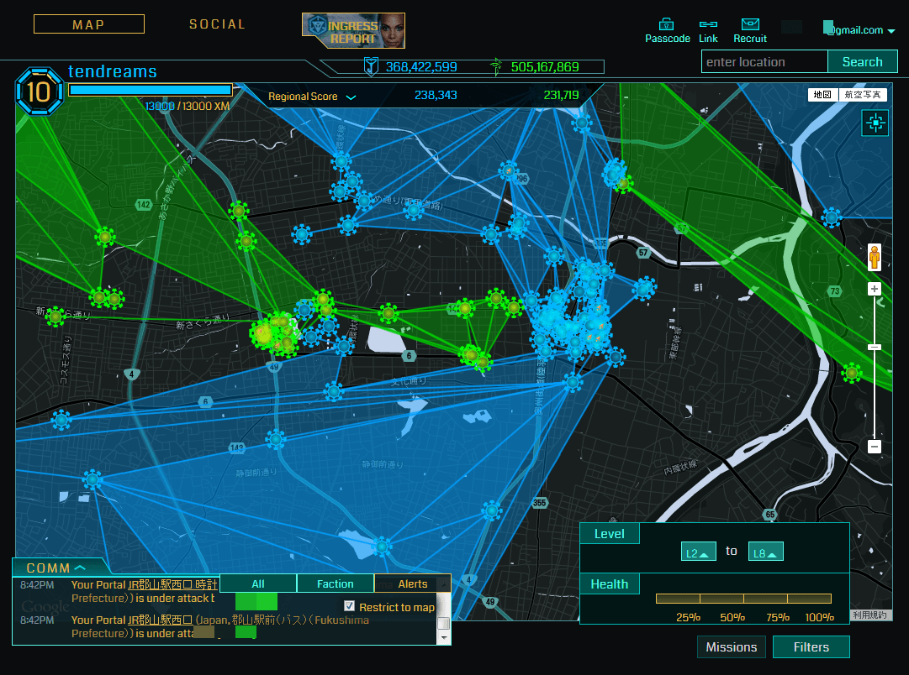
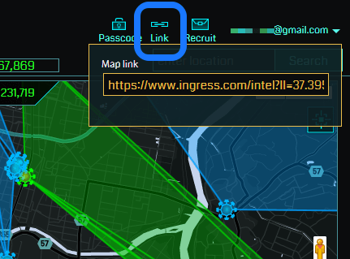
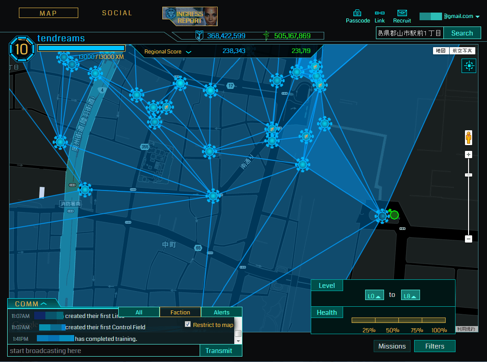
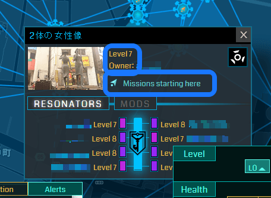
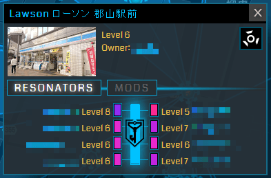
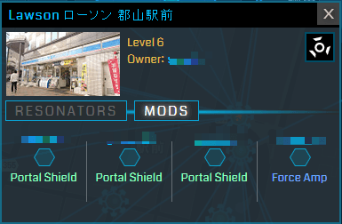
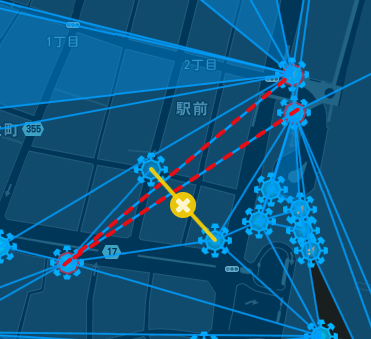
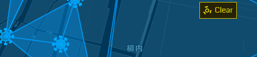

# 第三章　Intelを使おう！
この章では、「どうやってポータルを探せばいいの？」という疑問にお答えしましょう。

ズバリ、Intelマップを使います。

## Intelマップとは
Ingressは、ポータルをハックして、リンクして、コントロール・フィールドを作るのが目的だ、ということはわかったけど、じゃあ、そのポータルってどこにあるの？　ひたすらスキャナーを持ったままウロウロしていればいいの？

もっともな疑問です。じつは、日本の東京のような「ポータル異常密集地」では、「スキャナーを持ってウロウロ」でなんとかなってしまいます。それから、東京ディズニー・リゾートやユニバーサル・スタジオ・ジャパン、東武ワールドスクウェアや上野動物園など、世の中には「ポータル異常密集地」がたくさんあります（とくに日本には）。

でも、いつもそういう決まった場所でだけIngressをするのはプレイスタイルとしては異端です。Ingressは、もっと日常に密着したゲームです。

自分のふだんの行動範囲にどういうポータルがあるのかを知っておくべきでしょう。あるいは、ふだんの行動範囲をちょっと拡げるとしたら、どの辺に足を伸ばせば効率的にIngressができるのか、確認しておくべきでしょう。

多くのエージェントは、**Intel（インテル）**とよばれるポータルマップを使っています。

- [https://www.ingress.com/intel](https://www.ingress.com/intel)

Intelに初めてアクセスすると、Ingressで使用しているGoogleアカウントでのログインを求められます。

上記のURLにログインすると、世界地図が表示されます。あまりにも多くのポータルを拾ってしまって、処理が遅くなるので、次回からは、もっと範囲を狭めて、ブラウザのブックマークに入れておくべきでしょう。

ここではわかりやすくするため、PC版のIntelで説明します。

Intelでズームインするには、マウスのホイールを上へ回すか、マップ右側にある［＋］ボタンをクリックします。「この範囲のマップをブックマークしておきたい」という範囲が表示されたら、マップ右上の**［Link］**をクリック。その範囲のリンクを生成してくれます（このリンクをスマホでも使うために、自分のスマホに送っておくとよいと思います）。

たとえば、福島県郡山市を中心としたMapのURLは

- [https://www.ingress.com/intel?ll=37.395828,140.378675&z=14](https://www.ingress.com/intel?ll=37.395828,140.378675&z=14)

です。単純に、経度緯度にズームレベルが組み合わさっただけなのがわかります。

もっとピンポイントで一気にマップをズームさせたいときは、**［Search］**の欄に住所を入力してEnterします。

たとえば、福島県のJR郡山駅にズームするなら「福島県郡山市駅前１丁目」と入力します。

## ポータルの表示
（レジスタンスだとすると）自陣ポータルは青色で示されています。周りに8本の足（手？）が伸びているなら、レゾネータが8本挿さっている状態で、リンク可能であることを示しています。

そしてじっさいに、ポータル同士がリンクしていることも確認できるかもしれません。

タイミングによっては、青色の、つまり自陣のポータルがひとつもないかもしれません。緑色の、敵陣のポータルが見えているかもしれません。

いずれにしても、レジスタンスのポータルとそのリンクは青色で、エンライテンドのポータルとそのリンクは緑色で示されます。

また、コントロール・フィールド（CF）は、レジスタンスなら薄い青色で、エンライテンドなら薄い緑色で覆われています。色の「濃さ」が違うところも見えるかもしれません。もし見ることができたなら、それは**「多重CF」**という、Ingressのプレイとして、敵味方関係なく尊敬される種類のCF作成方法だ、ということを覚えておくとよいかもしれません。

多重CFは、キーさえあれば、低いレベルのうちから作成可能なので、このガイドでも後で触れようと思います。

## COMM
画面左下に、スキャナにもあったCOMMタブがあります。スキャナのCOMMでは、自分の現在地を中心とした、レンジを対象に（5kmから20kmぐらいが現実的でしょう）メッセージを発することができますが、Intelからだと、自宅に居ながらにして、地球の裏側の都市であろうとピンポイントでメッセージを投下することができます。

COMMの使い方にも、初心者のうちから、少しだけ慣れておくべきだと思います。

覚えておくべきことは

- Allに話しかけると、敵味方関係なくメッセージが伝わる
- Factionに話しかけると、味方陣営にのみメッセージが伝わる
- エージェント名の前に@（アットマーク）をつけて話しかけると、話しかけた相手に通知が飛ぶ（メッセージ内容は他の人も見られる）＝これを**「メンション」**という

このぐらいです。

自分にメンションがきたら、話しかけてきた相手のエージェント名をクリックすると、送信欄に自動的に相手にメンションを返すことができるように入力されます。

## ポータル・レベル
Ingressではアイテムに1～8までのレベルがあったように、ポータルにもレベルがあります。ポータルのレベルなので**P1～P8**と省略します。

**ポータルのレベルは、デプロイされているレゾネータのレベルによって決まります。**具体的には、それぞれのレゾネータのレベルの和（足し算した総合計）を8で割った数値の端数を切り捨てた値になります。

ちなみに、中立の状態ではレベル0ですが、1本でもレゾネータが刺さっていると、P1になるようです（この点だけ例外）。

たとえば、8つのレゾネータの枠に、R8が3本、R7が3本、R6が2本、合計8本のレゾネータが挿さっているとき、和は（8+8+8+7+7+7+6+6＝）57、これを8で割ると7.125なので、このポータルのレベルは7になります。これをP7と省略して表現します。

ここで、Intelの右下を見てください。

**［Filters］**が選択された状態だと、［Level］という欄があって、ある程度ズームインしたならば［L0 to L8］と表示されます。これは「すべてのポータルを表示する」ということを意味しています。

世界地図レベルだと、低いレベルのポータルまで表示すると処理が遅くなるので、P8以上のみ表示されるようになります（それでもあまりに広い範囲だと、やはりかなり「重く」感じます）。

ここで［L0］をクリックして、［L8］とか［L7］とかにしてみましょう。もちろん、［L8］にすると、P8のポータルのみ表示されます。そのとき、P8未満のポータルは消えますが、リンクとCFは表示されたままです。

現時点でP8になっているのはどのポータルなのかを調べるのに便利です。

実際的には、P7以上のポータルを探すのに、これをよく使います。俗に「P7ファーム」などといいます。とはいえ、A8以上にならないと、高レベル・ファームの使い道がないのですが。

## ポータル・レベルと獲得アイテム
ポータルをハックすると、アイテムを獲得できるということが、チュートリアルからわかりました。

アイテムにもレベルがあることは、すでに述べたとおりです。

ハックしたときに獲得できるアイテムのレベルは、ハックしたポータルのレベルと、自分のアクセス・レベルが主に決定要因になります（他にも、自分のインベントリの状態がかかわる、といった未確認情報もあります）。

当然、高レベル・ポータルからの方が高レベル・アイテムが出やすいので、プレイヤーたちは協力してポータルのレベルを高い水準に維持しようとします。

ちなみに**ファーム**というのは、つねに一定以上のレベルに保たれているポータルが、複数箇所密集している場所のことです。

ポータル・レベルが高くないと高レベル・アイテムが出にくいので、敵味方の暗黙の了解で、あえて攻撃せずに、アイテム稼ぎのために敵陣ファームを温存していることがあります（地域によります）。

アクセス・レベルが上がって、敵ポータルを破壊できるようになったら、地域のコミュニティやハングアウトで確認して、うっかりファームを壊さないように考慮する場面も出てくるかもしれません（でも、旅のエージェントが綺麗さっぱり敵ファームを一掃していくのをIntelで眺めるのも、楽しいものです。あ、それと、**A8になるまでは、そういった「他プレイヤーへの配慮」はあまり必要ありません**。A8になったときのために、考える癖をつけるのは良いことですが、それであなたのレベルアップの妨げになることは、他の高レベル・プレイヤーも望んでいません！）。

## ポータルの減衰
では、［Filters］セクションのもうひとつ、**［Health］**の欄を見てみましょう。

触ってみるとわかりますが、［25％］に設定すると、ほとんどのポータルが消えてしまいます（［L0 to L8］にして、試してみましょう）。

チュートリアルで、レゾネータのXMが減衰しているときに、リチャージで回復させたことを覚えているでしょう。

レゾネータのXMは、敵からの攻撃を受けたり、あるいは一定期間過ぎることで、減っていきます。

［Health］は、リチャージが必要な、逆に言えばもう少しの攻撃で破壊可能なポータルを調べるのに使います。

自陣ポータルの場合、そのポータルのキーを持っていれば遠隔リチャージが可能ですし、敵陣ポータルの場合、低レベルのエージェントの攻撃でも破壊できるかもしれません。

とはいえ、［Health］はほとんど使われません（よく使うぞ、というエージェントの方がいたらゴメンナサイ。ぼくは一度も使ったことがありません）。

## Mission
［Filters］の隣に、**［Missions］**というボタンがあります。これは、この文章を書いている数週間前に実装されたばかりの機能です。

スキャナーの［OPS］をタップすると、MISSION（ミッション）タブがありますね（INTELタブも見つけたかもしれませんが、それはちょっと後にとっておいてください）。

スキャナーでMISSIONをタップすると、現在地から近い位置が開始ポイントのミッション一覧が表示されます。

**ミッションは、地域に根ざした（ものが多い）、陣営に関係なく参加できるIngress内ミニゲーム**のようなものです。15分ていどで終わる簡単なものから、数日かけなければ完了しない鬼畜ミッションまで、数多くあります。

たいていの地域には、駅前の主要なポータルをいくつかハックするだけのご当地紹介ミッションがあるので、旅行や出張で他地域に遠征した時には、まずスキャナでその土地にある一番易しいミッションにとりくむのが定番です。

Intelの［Filters］に［Missions］が追加されたので、少し遠出して行く予定の地域に、どんなミッションがあるのか、調べることができるようになりました。

もうひとつミッション関連で、Intelマップ中のポータルの中に、右上を向いた黄色い矢印があるものが見つかりましたか？

矢印マークは、ミッションのスタートポイントを示しています。クリックすると、［Missions starting here］と表示されます。

とはいえ、ミッションには順番が決まっているものと、どこからスタートしてもよいものとがあり、後者のほうが多いので、必ずしもそのポータルからミッションを開始すべきというわけではありません。多くの場合、ミッション作成者はそのポータルからスタートすることを想定しているようですが。

## Intelでポータル詳細を見てみる
では、Intelに表示されているポータルを、どれでもいいのでクリックしてみましょう。

- ポータルレベル
- 誰がオーナーか（中立化した後最初にレゾネーターを挿した人）
- 誰のどのレベルのレゾネーターが挿さっているか
- ポータルの写真

が表示されます。

**［MODS］**というボタンがあるので、クリックしてみましょう。今度は、4つの枠があって、誰がどのMODを挿したかが表示されています（挿さっていない場合は何も表示されません）。

ところで、MODに関しては、説明がまだでした。

## MODとはなにか
アイテムの一種です。

自陣のポータルに、MODをインストールすることで、ポータルのなんらかの性能をアップさせることができます。

MODには次のような特徴があります：

- 1つのポータルに最大4つインストールできる
- 1人2つまで、同一ポータルにインストールできる
- レゾネータがアップグレード可能なのとは違って、上書きできない

A6未満のエージェントは、MOD枠が開いているポータルを見つけたら、とりあえず何も考えずに、何でもインストールするべきだと思います。

MODの中には、インストールすることがためらわれる種類のものがあります。

たとえば、日本ではLink Amp（リンクアンプ）はほとんど役に立ちません。Link Ampは、リンク可能距離をアップするMODです。日本のような狭い国土にポータルが密集している地域で、LinkAmpを使うことは、大規模作戦においてぐらいのものです。

高レベルなのに、1つのポータルにLink Ampを2つ挿す人を見つけたら、リンクアンプ教団の信徒だと思って間違いありません。リンクアンプ教団は世界的な宗教団体で、[Google+にも専用コミュニティ](https://plus.google.com/u/0/communities/118054689537110054363)があります。

ネットでIngressの情報を検索していると、Link Ampを使うと嫌われる、というような誤った情報がよくありますが（一時期ほどは見かけなくなりました）あまり気にする人はいません。

とにかく、アクセス・レベルが低いうちは、APを稼ぐことだけ考えること。MODをインストールするとAPが獲得できるのだから、迷わずインストールするべきです。

上で「A6未満」と限定したのは、A6ぐらいになって、攻撃も可能になってくると、地域でも目立つ存在になるため、それなりに戦略を考えてMODのインストールも行うべきだからです（これは人目を気にしよう、という消極的な理由です）。

もうひとつの理由。MODには、アイテムとしての出現確率の違いがあります。Rare（レア）とかVery Rare（ベリー・レア）という修飾がつくものです。あまり温存させても意味が無いので、低いレベルのうちは、どんどん使ってよいと思います。

ですが、A6ぐらいになったら、レア・アイテムの使いドコロが感覚的にわかってきます。

## リンク計画機能
PC版Intelでもうひとつ、触れておきたい機能があります。

ポータルをクリックすると、右上に、「困った犬の顔」を45度回転させたようなマークがあります。

これをクリックして、画面に出ている別のポータルをクリックしてみましょう。

黄色いラインで、仮想のリンクが表示されます。ポータル間に邪魔なリンクがあると、邪魔なリンクが赤のドットラインになります。

仮想リンクの上にはバツ印があって、これをクリックすると消えます。また、Intelマップの右上に［Clear］というボタンが出るので、それで消すこともできます。

「このポータルから、あのポータルに、リンクを貼ることはできるだろうか？」などと考えながら、計画をねるのは楽しいものです。

## スマホ版Intel
さて、先ほど、PC版で範囲を制限したリンクを取得しました。このリンクURLを、何らかの方法で、スマホに送りましょう。方法として考えられるのは、

- PCでもスマホでも同じブラウザを使う（ブックマークを共有する）
- Pushbullet（アプリ）を使う

どちらでもいいと思います。

[Pushbullet](https://www.pushbullet.com/)は、スマホの通知とPCデスクトップを連動させるもので、なにかと便利です。PCデスクトップ版には、FirefoxとChromeの拡張機能版があります。クリップボードの共有もできます。Ingressに関係なく、必須のアプリです。

さて、スマホ版のIntelですが、PC版が、Googleマップとほとんど同じ操作だったのと同様、スマホ版も、Googleマップと使い方は同じです。ピンチアウトでズームイン。ピンチインでズームアウト。以上、説明終わり、です。

AndroidユーザーはIngress Intel Helperというアプリを使っている人も多いようです。単純にIntelを見るのに特化した軽量ブラウザというだけのようですが（よくわかりません）。

ところで、

**「IITCっていうのが最強のIntelなんでしょ？」「でもIITCはアカウントBANの対象なんでしょ？」「使ったらいけないの？」**

……というような疑問を持つ方もいるかもしれません。この疑問には、このガイドの中で、少し触れます。「IITCって何？」という方は、まだググらないでください。いろいろと情報が玉石混交の状態で混在していて、混乱するだけです。

次章では、ポータルキーの集めかた、Capsuleの使い方を解説します！
