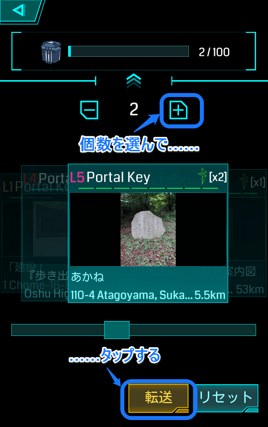
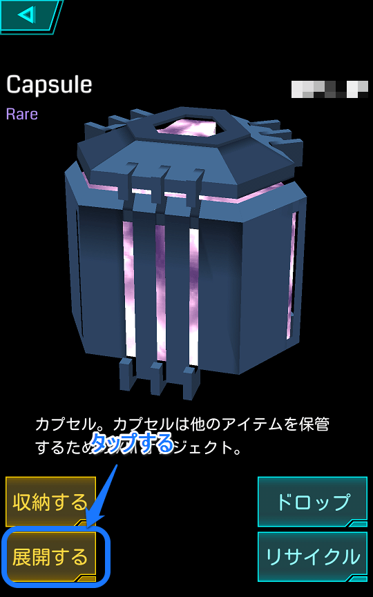

# 第四章　ポータルキーを集めよう！（Capsuleを使うのだ）
初心者エージェントは、なかなかAPを稼ぐ機会に恵まれません。破壊もできないし、レゾネータのアップグレードもできない。もちろん、敵ポータルがたくさんある地域に住んでいれば、ただひたすらハックしていればレベルアップできてしまいますが、我々Resistanceは（ですよね？）**「見渡す限り、青ばっかり！」**という絶望感に、しばしば襲われます。

Ingressは、ほんとうに初心者に厳しいゲームです（この問題を解決する施策が、この文章を書いている数日前に実装されました。それが「グリフハックによるAP獲得」なのですが、これについては次章で解説します）。

破壊ができないレベルでの、そして破壊ができるようになってからも、Ingressにおける主要なレベルアップ手段は**リンク**と**コントロール・フィールド**の作成です。トレーニングでわかったように、リンクには、そしてコントロール・フィールド作成には、**ポータルキー**が必要です。

この章のポイントは、**ポータルキーを貯める**ことです。

## ポータルキー
ポータルをハックすると、100%ではありませんが、ポータルキーを獲得できます。

キーはリンクで消費されます。

ポータルキーは重要アイテムです。可能な限りたくさん集めたいところです。といっても、500本を超えると、さすがにインベントリを圧迫していると感じますが……（ぼくは定期的にポータルキーを街中に捨てて歩きます）。

ところで、**いくらハックしても、ポータルキーが出てこない**ケースがあります。

それはズバリ、**すでにそのポータルのキーを持っている**、というケースです。

ポータルに近づいて、スキャナーの中のポータルをタップすると、ポータル詳細画面が出ますね。

この詳細画面の（現時点では）左下に、カギのマークがあります。ここが黄色になっているときは、そのポータルのポータルキーがインベントリの中にある、ということを意味しています。

あれ？　ということは、ひとつのポータルのキーを、複数持つことは、できない？？？

心配ご無用。

ぼくは「とある」ポータルのキーは、常時10本持つようにしています。ちょっと遠出しないとそのポータルを訪問することができないけれど、コントロール・フィールド作成の戦略上重要だ、というポータルのキーは、遠征したときに15本ぐらい獲得するように心がけています。

方法。2つあります。

**【その1】その場でキーをドロップする。**

［OPS］からインベントリを開いて、眼の前のポータルのキーを選択して、［DROP］（ドロップ）する。

ドロップすると、スキャナ画面にもキーが現れます（小さいので見逃さないように！）。

この状態でポータルをハックし、キーをゲットしたのを確認してから、自分がドロップしたキーを拾います。

これは楽ですが、欠点としては、

1. 複数本だとかえって面倒。
2. ハックしている間に他のエージェントに拾われるおそれがある。
3. GPSのズレなどが原因で、行方不明になることがよくある。

次の「その2」の方法が一般的です。

**【その2】Capsule（カプセル）に収納する。**

Capsuleというアイテムの使用方法を、解説しましょう。

## Capsule
リンクするときには、インベントリのなかの［Portal Keys］（ポータルキー）カテゴリにそのキーが存在している必要があります。これを**「むき出し状態」**のキーと表現することにします。

インベントリに**「むき出し状態」**でキーが入っていると、すでのそのポータルのキーを所有していると判断され、ハック時にポータルキーが出ません。

そこで、**Capsule**を選択し、**［LOAD］（収納する）**ボタンをタップして、該当キーを選択し、**［+］ボタン**で収納する個数を選び、**［TRANSFER］（転送）**ボタンをタップします。

**Capsuleに入れている間は、そのキーをリンクで使用することができなくなり**、ポータル詳細画面を見ても、キーを保持していないステータスになります。

これでポータルをハックすれば、100%ではないものの、キーが出てきます。

リンクでキーを使いたいときは、再度Capsuleを選択して、［UNLOAD］（展開する）ボタンをタップし、インベントリに荷降ろしするキーを選択して、［+］ボタンで個数を選択、［TRANSFER］（転送）ボタンをタップします。

これはすべてのエージェントが行っている基本動作ですが、欠点としては、

1. Capsuleへの出し入れは、とにかくめんどくさい（Ingress最大の欠点のひとつ）。

ということがあげられます。

インベントリの**［Portal Keys］**セクションでは、**［by Title］**（名前順＝アルファベット順）と**［by Distance］**（距離）の2つのソート方法が選べますが、Capsuleへの出し入れは、**必ずタイトル順**になります。

「距離」は、現在地からの距離の順です。

ポータルキーの名前（＝ポータル名）がアルファベットや数字で始まっている場合（「JR～駅」とか）は楽ですが、「東部ガス駐車場の稲荷神社」と「五百渕公園」では、どっちが前にあるのかわからなくて、探しまわるはめになります。

アルファベットと数字以外の、日本語文字（いわゆる「2バイト文字」）で1文字目が始まるポータル名は、文字コード順になるようです。

漢字よりもカナが前。

カナよりも記号（カッコなど）が前。

あとは、普段から［by Title］（名前）でPortal Keyを扱うようにして慣れるのが一番です。スライドバーをタップして、一発でお目当てのキーが現れたときは、格別の快感を感じるものです。ぼくは。

ぼくの知り合いのエージェントは、ハックしたらキーをすべてCAPSULEに収納する、という習慣があるため、某ポータルのキーを100本単位で持っています。

ところで、Capsuleには、100までのアイテムしか収納することができません。1つや2つのCapsuleでは足りなくなってきます。とくに地域ごとにキーを分類したい場合。

たとえばぼくの場合、仙台や東京のキーがインベントリに「むき出しで」あると、リンクボタンをタップしたときに、仙台や東京のポータルにもリンク可能かどうか、計算し始めるので、処理がとても遅くなります。

なので、直近で使用する予定がないキーは、地域ごとにCapsuleに収納しています。

始めたばかりだと、Capsuleが1つしかないかもしれません（たしか、SMS認証が済むともらえるのではなかったでしたっけ？）。

地域のコミュニティに参加すると、誰かしら、Capsuleを余らせているものです。ハングアウトで「誰かカプセル譲ってください！」と声をかけてみるのもひとつの手でしょう。

次章は、もうひとつの、低レベル・エージェントに優しいAP稼ぎ、「グリフハック」の解説です。