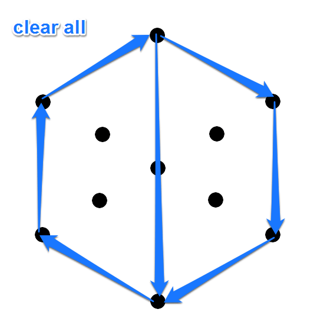
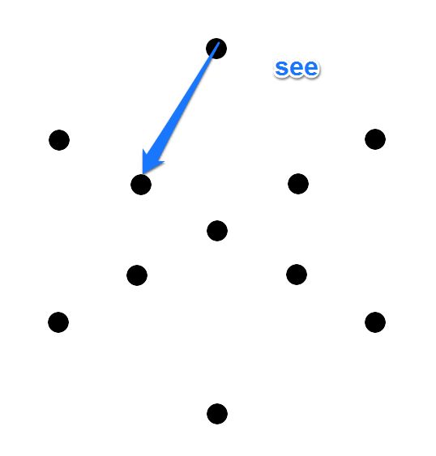
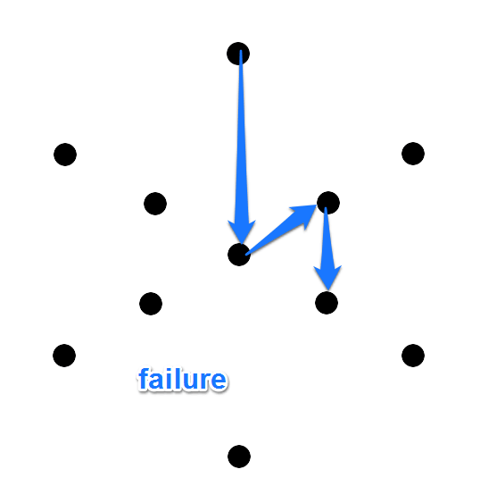
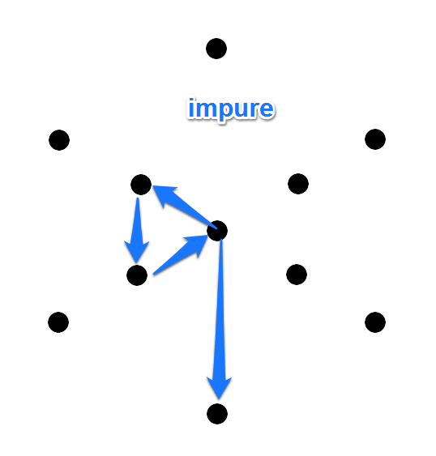
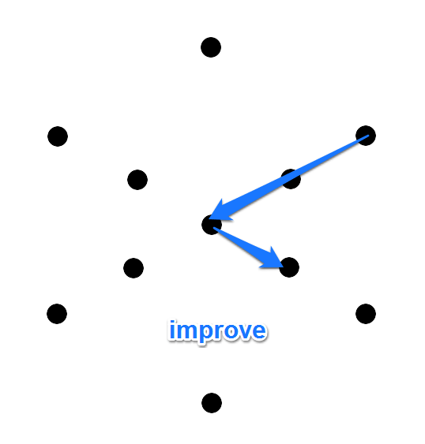

# 第五章　ハックとグリフハック
前章で、Ingressは初心者に（とくにレジスタンス陣営にとって）厳しいゲームだということを述べました。理由は：

- 世の中青ポータルばっかり。
- 緑があっても、自分のレベルが低いと壊せない。
- リンクはすでに貼ってある。

などなど。

ぼくはこれを**「クソ高レベル・エージェント問題」**とよんでいます（今考えました）。

ぼくはA1からA4まで、3レベル上げるのに、3か月かかりました。心が折れそうになりました。

A4からA7に3レベル上げるのに、3週間しかかかりませんでした。

こんなゲームがあっていいのだろうか……。

ところが、つい先日、この問題を一挙に解決する、ゲームシステムの変更がありました！

それはすなわち、**「グリフハックが成功すれば、味方ポータルへのハックでもAPがもらえる」**という仕様変更です。

グリフハックとは……という疑問にお答えする前に、そもそもハックとは、どういう性質のものでしょうか。ここでざっくり整理しておきたいと思います。

## ハック
スキャナにポータルが現れました。あなたは40m以内に近づいて、ハックしようとするでしょう。その目的は、味方ポータルであれば、ポータルキーをはじめとしたアイテム取得かもしれませんし、敵ポータルであればさらにAP獲得も目的かもしれません。

味方ポータルと敵ポータルの違いは：

- 味方ポータル（または中立ポータル）をハックすると、必ず1つはレゾネータを獲得できる。

というものです。言い換えるなら、**敵ポータルをハックすると、獲得アイテムがゼロということがありうる**、ということになります（2014年の一時期、アイテム2倍キャンペーン期間がありました。その期間は、味方ポータルはレゾネータが出やすく、敵ポータルは武器が出やすい、という特徴がありましたが、現在では明らかにわかる確率の違いは未確認です）。

また、獲得できる可能性のあるアイテムのレベルは：

- 自分のアクセスレベルよりも高いレベルのポータルをハックすると、自分のレベル+2までのアイテムが出やすい。
- 同じポータルレベルでも、挿さっているレゾネータのレベルが高いほうが、高いレベルのアイテムが出やすい。

それからつい忘れがちなのが、XMの消費です。Ingressでは、ほとんどすべてのスキャナー内アクションにXMの消費がともないます。ポータルのハックにもXMは消費されます。**高いレベルのポータルほどXM消費量も多い**ことに気をつけてください。P1をハックするのに必要なXMは50で、以降1レベルごとに50ずつ増えていきます。P8のハックには400必要です。ハックしようとしてもXMが足りなければ「ハック失敗」になります。

**ハックに関してもっとも重要な留意点**は：

- 通常、**1度ハックしたら、そのポータルは5分間待たなければ次のハックができない（オーバーヒート）**。
- 通常、**同じポータルを4回ハックしたら、最初のハックから4時間待たなければ次のハックができない（バーンアウト）**。

「通常」という但し書きをしたのは、インストールしてあるMODの種類によっては、条件が変わるからです。

ハックにかかわるMODについて、ここで簡単に触れておきます。

### Heat Sink
ポータルをハックすると、通常は「オーバーヒート」状態になり、300秒（5分）の冷却期間が必要になります。この冷却期間を短縮するMODが**Heat Sink（ヒートシンク）**です。

Common（コモン）、Rare（レア）、Very Rare（ベリーレア）の3種類があり、それぞれ短縮される時間は：

- Common: 20%（300秒が240秒＝4分に）
- Rare: 50%（300秒が150秒＝2分30秒に）
- Very Rare: 70%（300秒が90秒＝1分30秒に）

もちろん、ひとつのポータルに複数のHeat Sinkをインストールすることもできます。ただし2個め以降は効果がその50％になります（レア度が高い方を優先して効果の計算がなされます）。

また、重要なポイントとして、**Heat Sinkをインストールしたエージェントは、すぐに次回のハックができる**という点があります。つまりハックしてオーバーヒートしているポータルにHeat Sinkをインストールすれば、待たずに即ハックできます。

それから、つい最近の仕様変更により、**Heat Sinkをインストールすることで、バーンアウトまでのカウントもリセットされる**ようになりました。

なお、Heat Sinkの「オーバーヒート」と「バーンアウト」のリセットボーナスは、インストールしたエージェントに対してのみ、付与されるボーナスです。

### Multi-Hack
同一ポータルを4回ハックすると、通常は「バーンアウト」状態になり、最初のハックから4時間の冷却期間が必要になります。この4回という「ハック可能回数」を増やすMODが**Multi-Hack（マルチハック）**です。

Common、Rare、Very Rareの3種類があり、それぞれ増えるハック回数は：

- Common: 4（4回が8回に）
- Rare: 8（4回が12回に）
- Very Rare: 12（4回が16回に）

これも、ひとつのポータルに複数のMulti-Hackをインストールすることができます。ただし2個め以降は効果がその50％になります（レア度が高い方を優先して効果の計算がなされます）。

バーンアウト状態になっているポータルにインストールしてもOKです。4回ハックしてバーンアウトしたら、CommonMHを挿せば、さらに4回ハックできることになります。

Heat SinkとMulti-Hackを組み合わせれば、MHで8回ハック→HSを挿してリセット、さらに8回ハック、のようにして、ポータルキーを集中して集めることが可能です。

さて、通常のハックに関しては、以上が基本事項です。

グリフハックでAPを獲得できるようになった現在、初心者にとって、グリフハックはきわめて重要なポイントになるでしょう。

## グリフハックとは
グリフハックは、通常のハック（ハックボタンをタップ）とは少し違います。

ポータルを見つけたら、スキャナ上のポータルをタップするところまでは同じです。

次に［ハック］ボタンを、ただタップするのではなく、**ホールド（ロングタップ）**します。

ホールドしている間、ゲージが上昇します。ゲージが満タンになると、「グリフゲーム」に突入します（この時点で指を離してOK）。

グリフゲームは、**一言で言えば、「暗記ゲーム」**です。

グリフゲームに突入すると、11個のドットが現れます。

11個のドットの上を、光が走って、「グリフ」（文字）を暗記するように促されます。

特定の出題数の分、グリフが出題された後（たいてい数個あるので、「グリフシーケンス」といいます）、カウントダウンがはじまり、所定時間以内に、出題グリフと同じグリフを、**【一筆書きで】**（←重要）なぞります。

正答すると**正答数に応じて「ハッキングボーナス」**が加算され、回答を終えるまでの**スピードに応じて「スピードボーナス」**が加算されます。

全問正答しないと「スピードボーナス」はつきません。

「ハッキングボーナス」と「スピードボーナス」は、獲得アイテムのボーナスのことですが、APの数値にもかかわるようです。

もらえるAPの数値は、計算式が細かいのでここでは書きませんが、1問でも不正解があれば、**50×正解数**になります。

出題数、というのは、文字がおさまる枠の数のことです。ポータルレベルとアクセスレベルに応じて、「枠」（出題数）が決まります（ポータルレベルとアクセスレベルの低い方に応じて出題数が決まる）。また、（ここで初めて**「実績」**について具体的に触れることになりますが）全問正解した場合、Translator Pointが付与されます。獲得ポイントはエージェントプロフィール画面で確認できます。

|P LVLとA LVLの低い方|出題数|Translator      |
|-------------------:|-----:|---------------:|
|0～1                |1     |1               |
|2                   |2     |2               |
|3                   |3     |4               |
|4                   |3     |4               |
|5                   |3     |4               |
|6                   |4     |8               |
|7                   |4     |8               |
|8                   |5     |15              |

出題数が少ないほど、覚えなければならないグリフの数が少ないので、楽です。逆に、出題数が多いほど、ボーナスがたくさんつきます。

初めてP8の5連ハックに成功したときは、記念にスクリーンショットを撮ることになっています。

### グリフをどうやって覚えるか
グリフハックが苦手、という人は多いです。アクセスレベルが高い人でも。

まずは、出題されるグリフの種類を、英単語の丸暗記の要領で覚えてしまいましょう（100数個しかありませんから、本気でやれば1日で覚えられます）。

ひとつのグリフには、ひとつ以上の英単語が対応しています。答え合わせのときには、ひとつの英単語しか表示されません。

すぐに覚えるのは難しいと思うので、グリフハック・トレーニング用のアプリでトレーニングしながら、実戦をくり返すのがコツです。

- Android用：[Glypher](https://play.google.com/store/apps/details?id=com.dmidroid.ingress.glyphs&hl=ja)
- iPhone用：[Glyph Mastery](https://itunes.apple.com/jp/app/glyph-mastery/id903701519)

#### まずは頻出基本語から
英単語の`CLEAR`（クリア：除去・明瞭）を意味するグリフはとても簡単です。

英単語の`OPEN`（オープン：開放）または`ACCEPT`（アクセプト：受容）を意味するグリフもとても簡単です。

英単語の`ALL`（オール：全部）を意味するグリフもとても簡単です。

3つ覚えましたね？　では次のグリフは何でしょう？

そう、`CLEAR ALL`（クリアオール：全消去）です。では次は？

そう、`OPEN ALL`（オープンオール：全開放）です。

この種の、複数重なり系は、`OPEN ALL`と`CLEAR ALL`だけじゃなかったかな～と思います。これが連続で出やすいので、厄介です。なぞる距離が長いので。だいたい、4連グリフで`CLEAR ALL, OPEN ALL, DISCOVER, TRUTH`というフレーズで出ます。

**頻出フレーズは決まっており、意味もある**ことに着目しましょう。グリフシーケンスの覚え方にもいろいろありますが、おススメは**対応する英単語をブツブツとつぶやきながら、意味で把握すること**です。

`CLEAR ALL, OPEN ALL, DISCOVER, TRUTH`は「すべてを綺麗にして、すべてを開き、真実を発見せよ」ぐらいの意味でしょうか。英単語をいちいち日本語に訳していては英語の勉強にならないのと同様、グリフも、そのグリフの意味をそのまま覚えてしまう（「読み」は英語ですが）のがグリフハック成功のコツです。

#### Ingress語はそのまま覚えるしかない
Ingress特有の語彙があります。`XM`（エクスエム：XM）とか`PORTAL`（ポータル：ポータル）とか`SHAPERS`（シェイパーズ：シェイパー）とか（「シェイパー」というのは、Ingressのストーリー上重要な役割をもつ……何かです）、あるいは`RESISTANCE`（レジスタンス：抵抗）とか`ENLIGHTENMENT`（エンライトゥンメント：覚醒・啓蒙）など。

「グリフの意味をそのまま覚える」とは、この形を〈意味するもの：シニフィアン〉として、「XM」という意味を〈意味されるもの：シニフィエ〉として、ひとつの〈記号：シーニュ〉を形作っておくことです。

「なぜこれがポータルなのか」と思ってはいけません。この形はポータルを意味しているのです。もう、ポータルにしか見えません。

Ingressの背景ストーリーには「シェイパー」なる異世界の存在が頻繁に出てきますが、その姿形を我々は見ていません。むしろこのグリフメッセージによって、我々はシェイパーのイメージを獲得できたと言えるでしょう。ちなみに「Ingressスキャナーに発見されたコード」が出題してくる一連の文字列（つまりグリフシーケンス）のことを**「シェイパーグリフ」**といいます。おそらくシェイパーの意思によって出題されているか、もしくはシェイパーに意思を伝える手段か、そんなところなんでしょうね。

`RESISTANCE`は`STRUGGLE`（ストラグル：奮闘）も意味していますが、元々はレジスタンスのエンブレムである鍵（キー）をかたどったものです。これは珍しく具象的な文字です。

`ENLIGHTENED`は`ENLIGHTENMENT`も意味していますが、元々はエンライテンドのエンブレムである目をかたどったものです。これもレジスタンス同様、具象的な文字です。

Ingress語はこのぐらいかと思います。

#### 時間に関する語
`PAST`（パスト：過去）、`NOW`（ナウ：現在）または`PRESENT`（プリゼント：現在）、`FUTURE`（フューチャ：未来）は頻出です。

この3つは頻出フレーズにもよく使われます。4連グリフの`HUMAN, PAST, PRESENT, FUTURE`や`PAST, AGAIN, PRESENT, AGAIN`など。

注意すべきは、`NOW`と`EQUAL`（イコール：等価）が上下対称で形だけ似ているところです。

頻出フレーズに`PAST, EQUAL, FUTURE`（過去とは未来である）というものがありますが、ちょっとなにゆってんのかわかんないですよね。

#### 人間に関する語
まず、「パンティ」と俗に言われる（お上品な方は「パンツ」などと言いますが）`BODY`（ボディ：身体）を見ましょう。

どうみてもパンティですよね。それはともかく、面白いのが`MIND`（マインド：精神）と`SOUL`（ソウル：霊魂）を区別しているところです。

4連グリフの頻出フレーズに`LESS, SOUL, MORE, MIND`（魂が減れば、精神が増す）という謎のメッセージがありますが、SOULとMINDはバーター関係になっているという世界観なのでしょうか。

`BODY`と`MIND`と`SOUL`を合わせると、`HUMAN`（ヒューマン：人間）になります。

人間に関する語に入れていいものか迷いますが、`SELF`（セルフ：自己）は、スキャナーの手前に矢印が向かっていて、エージェント「自身」を指しているようにも見えます。

#### 比較的楽に覚えられるもの
見た感じそのまま、というものもあるし、単純な図形であるため覚えやすいというものもあります。上述の`CLEAR``OPEN``BODY``ALL`などがそうですね。

`BALANCE`（バランス：平衡）または`PERFECTION`（パーフェクション：完全）は見た感じがバランス（重り）っぽいし、完全性を表している感じがしますね。

`HARMONY`（ハーモニー：調和）は見た感じが調和！　って感じですよね。

`STRONG`（ストロング：強固）は安定感があって、いかにも強い感じですね。これで殴ると痛いぞ、みたいな。

`SEE`（シー：見る）はなんだか、適当に一番てっぺんからチョンと棒をひいただけに見えますね。ちょっと覗きました、みたいな感じがするでしょう。しませんか。そうですか。

`TRUTH`（トゥルース：真実）は無限大なんでしょうか。真実は無限のなかにある。

`SEPARATE`（セパレイト：分離）は文字通り、画面を分割しています。

`MESSAGE`（メッセイジ：伝達）は何かが伝わっている感じがします。

`MESSAGE`の類義語とでも言えばいいのでしょうか、`DATA`（データ：データ）は上から落ちてくるイメージです。

`IDEA`（アイディア：理念）または`THOUGHT`（ソート：思想）は何かのエンブレムみたいでかっこいいですね。

#### 対義語で覚えるべきもの
4連グリフの頻出フレーズ`LESS, SOUL, MORE, MIND`には、`SOUL`と`MIND`が左右対称になっていて、かつIngressの世界観では対義語であるという関係になっています。またこのフレーズの`LESS`（レス：減）と`MORE`（モア：増）は、**上下対称の対義語**になっています。

これに似たものに`LIVE`（リブ：生存・生命）または`BREATHE`（ブリーズ：呼吸）と、`DIE`（ダイ：死亡）の上下対称・対義語があります。

頻出4連フレーズに`BREATHE, NATURE, PERFECTION, HARMONEY`（自然の完全な調和を呼吸せよ）といったメッセージがありますが、この中の`BREATHE`が下向きなのか上向きなのかで迷ったら、`NATURE`は下向きだから`BREATHE`も下向き、と連想してもいいかもしれません。

`CIVILIZATION`（シビライゼイション：文明）と`NATURE`（ネイチャー：自然）も上下対称の対義語です。

`ATTACK`（アタック：攻撃）または`WAR`（ウォー：戦争）と`DEFEND`（ディフェンド：防衛）も上下対称の対義語です。

`NOURISH`（ノリッシュ：養育）と`RECHARFGE`（リチャージ：回復）も上下対称の対義語です（わかりにくいかもしれませんが、NOURISHは成長のために栄養を与えることで、RECHARGEは減っているものを回復させることです）。

これもわかりにくいかもしれませんが、`PURSUE`（パースー：追求）と`WANT`（ウォント：必要・欠乏）も上下対称の対義語です（追求するのは能動的ですが、欠乏しているのは受動的だと考えましょう）。

ここまで、上下対称・対義語を見てきました。ここから左右対称・対義語を見ていきます。

`CREATE`（クリエイト：想像）と`DESTROY`（デストロイ：破壊）は左右対称の対義語です。

`PATH`（パス：通路）と`BARRIER`（バリア：障壁）も左右対称の対義語です。

`FORGET`（フォゲット：忘却）と`IGNORE`（イグノア：無視）は左右対称の対義語です（忘れていることと、あえて忘れたふりをすることは逆、と考えましょう）。

`GAIN`（ゲイン：獲得）と`LOSE`（ルーズ：喪失）は左右対称の対義語です。

`ADVANCE`（アドバンス：前進）と`RETREAT`（リトリート：撤退）は左右対称の対義語です。

`ABANDON`（アバンダン：断念）と`RESTRAIN`（リストレイン：抑制）は左右対称の対義語です（ABANDONには放縦、奔放という意味があります）。

`EVOLUTION`（イヴォリューション：進化）または`SUCCESS`（サクセス：成功）と`FAILURE`（フェイリャ：失敗）は左右対称の対義語です。

ここまで、左右対称の対義語を見てきました。じつは、形は左右対称だけれど意味の対称性がよくわからないものがひとつあります。`SAVE`（セイブ：救済）と`ADAPT`（アダプト：適応）または`ADJUST`（アジャスト：順応）です。SAVEには「省く」という意味があるので、手間隙がかかる「適応」とは逆、とこじつけてもいいかもしれません。守ることは変化しないことで、適応することは変化すること、というように。

上下対称と左右対称を見てきましたが、これを組み合わせた、**上下左右対称**というのもあります。これは単純にいえば**180度回転**させたものです（上下反転させて、さらに左右を反転させる――上下対称と左右対称のうち、いくつかは上下左右対称でもあります）。

`PURE`（ピュア：純粋）と`IMPURE`（インピュア：不純）は上下左右対称の対義語です。

`NEW`（ニュー：新）と`OLD`（オールド：古）は上下左右対称の対義語です。

`IMPROVE`（インプルーブ：改善）と`DETERIORATE`（ディティリアレイト：悪化）は上下左右対称の対義語です。

`CAPTURE`（キャプチャ：捕獲）と`LIBERATE`（リベレイト：解放）は上下左右対称の対義語です。「開放」と「解放」は違いますからね。

`FEAR`（フィアー：恐怖）と`COURAGE`（カリッジ：勇気）は上下左右対称の対義語です。

#### 複雑だけれど、意外と覚えるのは楽なもの
初見では「なんじゃこりゃー！」と思ってしまうけれど、なぜか記憶に残りやすいグリフというものがあります。こういうグリフに限って頻出なので、はじめのうちに覚えてしまったほうが楽です。

`CHAOS`（ケイオス：混沌）は文字通りですが、意外と覚えやすい。でもドットの触り忘れがよくあるので注意しましょう。

`JOURNEY`（ジャーニー：旅）は文字通りスキャナー上を旅している感じがするので、むしろ覚えやすいカテゴリに入れたほうがよいかもしれません。

`WEAK`（ウイーク：脆弱）は`STRONG`と対にして覚えるべきかもしれませんが、いかにも不安定です。

`END`（エンド：終焉・目的）はなぜか右半分だけを使います。左半分はないようです。

`CONFLICT`（コンフリクト：葛藤・衝突）は俗に「M字開脚」のあだ名でよばれるものです。シェイパーグリフではしばしば「データ・コンフリクト」が生じます。こわいこわい。

`DANGER`（デンジャー：危機）はシンプルですが、あまりデンジャーな感じがしないのがポイントではないでしょうか。

`HARM`（ハーム：危害）は俗に「精子」とよばれますが（お上品な方は「ツチノコ」と言います）こっちのほうがデンジャーな感じがしますね。

`TOGETHER`（トゥギャザー：協力）は俗に「ハミ毛」とよばれますが、`BODY`を「パンティ」とよんでいなければ意味をなしません。

`POTENTIAL`（ポテンシャル：潜在）は上方にオープンな状態で、いかにも潜在能力とか可能性とかがありそうですよね。

`CONTEMPLATE`（コンテンプレイト：熟考）は、初めて目にしたときは「覚えられるかこんなの！」と思ったものですが、意外と、ミスしたことは一度もありません。一筆書きに向いている図形なんでしょうね。

`AVOID`（アヴォイド：回避）は右上に向かってM字ですね。回避するために体を右に倒しているところでしょうか。

`AGAIN`（アゲイン：再度）または`REPEAT`（リピート：反復）は、まるで反復感がないものの、頻出シーケンスでよく使われるため、否応なく覚えてしまうタイプかもしれません。

#### セットで覚えておくべきもの
上下または左右対称で、対義語のものを紹介しましたが、他にもペアにしたり、グループにして覚えると楽なものがあります。

まず`HAVE`（ハヴ：所有）と`CHANGE`（チェンジ：変更）は、使うドットの領域が同じで、同じく動詞なので、無理やりですが、セットにします。

`OUTSIDE`（アウトサイド：外側）または`DISTANCE`（ディスタンス：距離）と`INSIDE`（インサイド：内側）は

●よくある暗記法その1
ぼくもやったし、
どうやらみんなやったらしいのですが、
勝手にグリフに「あだ名」をつけるのが、
少ないグリフだと、楽です。

BODYというグリフは、
小さい三角形なので、ぼくは
「パンティ」
とよんでいました。

みんなはお上品ぶって
「パンツ」
などといっていますが、
どうみてもパンティです。

パンティから左下にチョロっと
一本出ているのはTOGETHERのグリフですが
「ハミ毛」
とぼくはよんでいました。

HARMは
「精子」
（上品な人は「ツチノコ」）

CONFLICTは
「M字開脚」
などなど、です。

●よくある暗記法その2
これはぼくは最近知ったのですが、
グリフに二文字熟語を当てはめる、
「翻訳法」とでもいうべき方法があるようです。

HUMAN＝人間
PAST＝過去
PRESENT＝現在
FUTURE＝未来

などなど。

グリフが4問、とかになると、
その「グリフシーケンス」に「意味」が
あるということが少しわかります。
その意味では、この翻訳法は、
意味もわかるし、けっこういい線いっている、
と思います。
でも、
グリフ→英語→日本語
という2重の翻訳が入るので、
ぼくはやる気が起きません。

●よくある暗記法その3
これはぼくが今でも必ずやっている方法です。
グリフに対応する英単語をすでに知っている、
ということが前提です。

ズバリ、出題中に、その英単語を声に出すこと。
周りに人がいても気にせず大声でやります。
（ブツブツと小さい声でもいいですが）

視覚の記憶はあてになりません。
口の筋肉に覚えさせるのです。

声に出すとき、
4連グリフだったら
低音→高音→低音→高音
と声のトーンを変えれば、
口だけじゃなく喉の筋肉も使って覚えることができます。

意識の中の、「記憶の神殿」の部屋も使います。
2部屋用意して、
左の1部屋に2グリフ、
右の1部屋に2グリフ、
収納すれば、忘れることはありえません。

とはいえ、指がすべって、一筆書きの時点で
よく間違えるのですが。

＃iPhoneの「Glyph Mastery」というアプリで